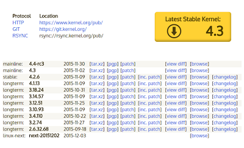

# Linux Kernel Customization 

The Linux kernel is the program that manages your hardware and establishes the virtual machines that programs run in. The kernel is also a vast and sprawling open source project. In this lesson you'll learn how to read kernel version, where you can obtain a kernel and we'll download and customize the kernel that Ubuntu provides with its distribution.

**Commands**

  * lsmod
  * insmod
  * modprobe
  * depmod
  * rmmod

**Further Reading**

  * [Linux Device Drivers, Third Edition](http://www.oreilly.com/openbook/linuxdrive3/book/)

## Introduction 

The kernel is not one open source project, it's many. Anyone that wishes to make their own version of Linux is free to do so with some limitations (you cannot make your version closed-source). Linus Torvalds and many others maintain the version that's considered the primary copy, known as the mainline version. You can find the source of the mainline version at kernel.org:

[https://www.kernel.org/](https://www.kernel.org/)

## Understanding Kernel Versions 



> Instead of a roadmap, there are technical guidelines. Instead of a central resource allocation, there are persons and companies who all have a stake in the further development of the Linux kernel, quite independently from one another: People like Linus Torvalds and I don't plan the kernel evolution. We don't sit there and think up the roadmap for the next two years, then assign resources to the various new features. That's because we don't have any resources. The resources are all owned by the various corporations who use and contribute to Linux, as well as by the various independent contributors out there. It's those people who own the resources who decide..."
>
> -- Kernel developer, [Andrew Morton](https://en.wikipedia.org/wiki/Andrew_Morton_(computer_programmer)

The picture on the right is a screen grab from kernel.org. The picture shows the different sorts of versions that are available to download. You may notice that there's a lot. The Linux kernel is under constant development so the version numbers are constantly changing.

### Kernel Types 

Each version is noted with a type in the left column. 

#### Mainline 

Mainline kernels are maintained by Linus Torvalds. The mainline kernels are where all new features are developed. If you're interested in developing new Linux systems these are the ones you should use. Mainline kernels are released every two to three months.

#### Prepatch or RC 

Mainline kernels that are being prepared for release are called prepatch or "release candidate" kernels. They are the testing grounds for new features. If you're a kernel developer working on drivers or you want the latest and greatest and don't mind a crash or two these kernels are for you.

#### Stable

When an RC kernel is ready it becomes a stable kernel. Stable kernels do not get new features but they get bug fixes. They last until a new stable kernel is released (about two to three months), unless it's designated to become a long term maintenance kernel. 

#### Longterm

Long term maintenance kernels are stable kernels where the community commits to making bug fixes for a period of two to six years. These kernels are critical for the Linux community members that need solid, stable systems for a long time (that's most of us!). Each long term kernel has a maintainer who is responsible for it during its long life.

#### linux-next

The "next" kernel is where day-to-day development happens. Updates are posted here and if they're not horribly broken they become a part of the mainline kernel. The next kernels are not to be used, they are for the purpose of coordinating software development.

### Kernel Version Numbers 

The logic behind the kernel version number has changed over the years.

#### 2.4 Series

The 2.4 series of kernels was released in 2001 and was maintained until 2011. Linux saw rapid adoption during this period. The 2.4 kernel was used in servers, desktops and embedded devices.

#### 2.6 Series

The 2.6 series of kernels was introduced in 2003 and made a number of incompatible changes to the way things worked. According to Linus it would be the last time that such incompatible changes would ever be made. The 2.6 kernels were a major step forward in features and performance and for the first time Linux started to rival commercial OSes.

#### 3, 4 and 5 Series

The 3, 4 and 5 series of kernels logically belong with the 2.6 series because they don't represent the same kind of incompatible change that happened between the 2.4 and 2.6 kernels. The numbering scheme was changed to make it easier on the eyes. The rule is a new major number (i.e. "3" or "4") will be introduced when the minor number reaches "about 20".

The version numbers work like this:

```
<series-number>.<minor-version>[.<patch-number>][<extra-version>][<local-version>]
```

Here's the version of Linux on my machine:

```
$ uname -r
3.13.0-71-generic
```

Here's how to read it:

| Series | Minor | Patch# | Extra | Local | 
| ------ | ----- | ------ | ----- | ----- | 
| 3      | 13    | 0      | 71 | generic | 


## Vendor Trees 

When a company uses Linux to power their product they may need to make changes to the kernel. Usually it's to add device drivers for proprietary hardware but sometimes they add new systems (e.g. to implement a new protocol). When a company does this they're obligated to make their kernel public. Ideally the company works with the community to add their software into the mainline kernel. However, corporate development isn't always compatible with the open source model and companies decide to work on a forkof the kernel. A fork is a copy of the kernel at a particular time. When a fork is maintained by the vendor of a product it's called a "vendor tree." Companies maintain their own fork and (hopefully) get their code back into mainline. Here are a few examples of vendor trees:

  * [Raspberry Pi's official Linux kernel](https://github.com/raspberrypi/linux) on GitHub
  * [The official Android Linux kernel](https://android.googlesource.com/kernel/)
  * [The official Xilinx Linux kernel](https://github.com/Xilinx/linux_xlnx) on GitHub

There are many more examples of vendor trees. If you're working with a non-PC product and want to update your kernel you should use the kernel provided by the vendor unless they tell you otherwise. Distributions also provide their own trees:

  * [Ubuntu's official kernel](http://kernel.ubuntu.com/git/)
  * [Fedora's official kernel](http://pkgs.fedoraproject.org/cgit/kernel.git/)

Distributions often add some non-official drivers to their Linux kernel to enable features that their users count on. For example the "aufs" driver enables LiveCD and LiveUSB systems but is not a part of the official Linux kernel. If you want to customize the kernel on your PC you should start with the kernel that is provided by your distribution. The mainline kernel may be missing features that you count on for a working system.

## Building Your Own Kernel 

It's not common to need your own kernel and you should be careful when you use one. It's good clean fun on your personal computer and I highly recommend building your own kernel. On a production system, however, you should consider a few questions before using a custom kernel:

#### Why do I need it? 
 
 Using a custom kernel prevents you from being able to submit bug reports to Ubuntu or RedHat. They don't want to have to disentangle their problems from your problems. So you should only customize the kernel on a production system if you suspect the current one is causing crashes and only after you have registered a bug report with your distribution. Do not use a newer kernel for optimizations or features, upgrade to a newer version of your distribution instead.

#### Do I have the time to keep my custom kernel up to date?
 
 Distributions make kernel updates available all the time. The updates fix bugs and security problems so it's important to stay up to date. When new kernels are available you will have to update your local source and recompile. This means you should set aside a few hours every month to stay up-to-date.
 
#### Do I only need to change or update kernel modules? 

It's easier to maintain custom modules than a whole kernel. If you just need driver updates consider compiling the relevant modules only. You will still have to compile your modules for every new kernel but the overall effort will be less.

### Get the Source 

On a normal Ubuntu installation the `dpkg-dev` package will be installed. On your Vagrant VM it is not. Install it:

```
$ sudo apt update
$ sudo apt install dpkg-dev 
```

You should get the kernel source from the distribution you're using. Distributions customize their kernels with additional drivers that may not be in the mainline version. If the drivers aren't present you may see problems. You can use apt-get to fetch Ubuntu's kernel sources that match your current version:

```
$ apt-get source linux
```

> **NOTE** This command will initially fail. You must go update /etc/apt/sources.list to include source code repositories (the ones that start with deb-src). The lines are already in the file, but commented out. Delete the hash character (#) from the lines and rerun apt-get update. Notice you don't have to be root. You should compile the kernel as a non-root user (of course only root can install it). The apt-get source command will place the downloaded source in the current directory. Here's an example of what files are downloaded:

```
$ ls -l
total 122480
drwxrwxr-x 27 mike mike   12288 Dec 2 09:36 linux-3.13.0
-rw-rw-r-- 1 mike mike  8945126 Nov 9 16:36 linux_3.13.0-68.111.diff.gz
-rw-rw-r-- 1 mike mike   11787 Nov 9 16:36 linux_3.13.0-68.111.dsc
-rw-rw-r-- 1 mike mike 116419243 Feb 3 2014 linux_3.13.0.orig.tar.gz
```

The tar file is the mainline source code for your kernel version and the diff file contains the Ubuntu-specific changes. The apt-get source command automatically unzips the tar file and applies the changes. The directory created contains the modified source and is ready to go.

### Setup 

You need the proper tools to compile a kernel, including the compiler. The following command instructs apt to fetch the packages needed for a kernel build:

```
$ sudo apt-get build-dep linux-image-$(uname -r)
```

The package list is not complete, however. A few extra packages are needed for some "nice to have" things, like menu-based configuration.

```
$ sudo apt-get install ncurses-dev bc libssl-dev
```

There may be others too.

### Kernel Configuration 

The kernel has a vast array of configuration options. You can include or exclude thousands of different device drivers and subsystems. It takes an expert to know what can be safely excluded without breaking things. Fortunately, on Ubuntu, the configuration of your current kernel is located in the /boot directory. That provides an excellent starting place. The current configuration of your kernel is stored in:

```
<kernel-root-directory>/.config
```

In my example above <kernel-root-directory> will be the linux-3.13.0 directory. Copy the default configuration into your build directory:

```
$ cp /boot/config-$(uname -r) .
$ make menuconfig
```

The default configuration enables all drivers that can be built as modules. That's 2GB+ of modules that will take your VM more than two hours to compile. Run this command to limit the drivers to only the set you're currently using:

```
$ make localmodconfig
```

The make `localmodconfig` command may ask some questions. You can hit "Enter" to select the default answers.

### Building and Installing the Kernel 

When you're satisfied with your configuration you build the kernel with the following command:

```
$ make
```

The command builds the kernel binary and all the modules. Before you can use them they'll need to be installed like this:

```
$ sudo make modules_install 
$ sudo make install
```

> **WARNING** Installing the new kernel will update GRUB's configuration to make your new kernel bootable by default. It won't delete old ones so you'll be able to recover if there's a problem.

## Kernel Modules 

The Linux kernel is monolithic. It's one big program, unlike the Windows kernel, which is modular. However, not all parts of the Linux kernel have to be loaded at the same time. When you compile your kernel you have the choice whether to compile functions permanently into the kernel or as loadable modules. Most device drivers are compiled as loadable modules because you don't know if you need them until after the kernel is booted. Compiling functions as modules keeps the size of the kernel down and is flexible. You can find the modules available for your kernel in the directory:

```
/lib/modules/$(uname -r)
```

Notice that there's a capturing quote in the path. That's because kernel modules are specific to a particular kernel version. On my linux host the `/lib/modules` directory contains:

```
$ ls /lib/modules
3.13.0-100-generic 3.13.0-63-generic 3.13.0-76-generic 3.13.0-91-generic 4.4.0-38-generic
3.13.0-101-generic 3.13.0-65-generic 3.13.0-77-generic 3.13.0-92-generic 4.4.0-42-generic
3.13.0-103-generic 3.13.0-66-generic 3.13.0-79-generic 3.13.0-93-generic 4.4.0-45-generic
3.13.0-57-generic  3.13.0-67-generic 3.13.0-83-generic 3.13.0-95-generic 4.4.0-47-generic
3.13.0-59-generic  3.13.0-68-generic 3.13.0-85-generic 3.13.0-96-generic 4.4.0-51-generic
3.13.0-61-generic  3.13.0-71-generic 3.13.0-86-generic 3.13.0-98-generic
3.13.0-62-generic  3.13.0-74-generic 3.13.0-88-generic 4.4.0-36-generic
```

There are modules for every installed kernel. Using the `$(uname -r)` construct is common when you're trying to refer to the module directory for the kernel that is running. Which is often the case.

### Module Dependencies 

The `lsmod` command shows you the modules that are present in your kernel

```
$ lsmod
Module         Size Used by
vmw_vsock_vmci_transport  28672 0
vsock         36864 1 vmw_vsock_vmci_transport
ppdev         20480 0
vmw_balloon      20480 0
input_leds       16384 0
joydev         20480 0
coretemp        16384 0
serio_raw       16384 0
vmw_vmci        65536 2 vmw_vsock_vmci_transport,vmw_balloon
[...snip...]
```

The `module` field is the name of the module. The size is how much code is loaded (in bytes). The number in the first part of the `used by` field tells you how many programs or other modules are actively using the module. When this number is non-zero the kernel will not let you unload the module. The rest of the "used by" field shows you what other modules depend on the module. In this example the following is true:

  * The "vsock" module is using36,864 bytes of memory for code.
  * The "vmw_vsock_vmci_transport" module depends on the "vsock" module

The kernel uses a file to keep track of module dependencies. You can look at the dependencies for you modules by looking in:

```
$ cat /lib/modules/$(uname -r)/modules.dep
```

If you install your own modules you must manually update that file using the command:

```
$ sudo depmod -a
```

### Inserting and Removing Modules 

There are two ways to install a module. When a module is listed id modules.dep it can be automatically inserted into the kernel (including any dependencies) with the modprobe command. This is the preferred way to insert modules. For example to load the device driver for Broadcom's NetXtreme II series of Ethernet controllers (which depend on the [Userspace I/O](https://www.kernel.org/doc/htmldocs/uio-howto/about.html) kernel module) run the command:

```
$ sudo modprobe cnic
```

You can use lsmod to confirm that the module loaded:

```
$ lsmod | grep cnic
cnic          65536 0
uio          20480 1 cnic
```

Note that the cnic module depends on the uio module. The modprobe automatically loads the required uio module before it loads the cnic module. Hassle free! Removing the module is done with rmmod. But, you cannot remove modules that are in use:

```
$ sudo rmmod uio
rmmod: ERROR: Module uio is in use by: cnic
```

So to undo what was just done you must unload the modules in the reverse order that they were loaded in:

```
$ sudo rmmod cnic
$ sudo rmmod uio
```

Sometimes you might want to insert a module that you just compiled yourself and have not yet installed into `/lib/modules`. To inert a module by its filename you use the `insmod` command. If you want to use insmod to do what we did with `modprobe` above you run the following commands:

```
$ sudo insmod /lib/modules/$(uname -r)/kernel/drivers/uio/uio.ko
$ sudo insmod /lib/modules/$(uname -r)/kernel/drivers/net/ethernet/broadcom/cnic.ko
```

If you try to install a module before it's dependencies are loaded `insmod` will fail with an error.

### Automatic Module Loading 

By now you've used Linux a lot and you've probably never loaded or unloaded a kernel module. That's because Linux has a system for automatically finding and loading the necessary modules. It didn't always! The system is run by the kernel module loader daemon (kmod). There's configuration you can alter if you need your kernel to do something special with drivers. The configuration is in:

```
/etc/modprobe.d
```

There are some important things there. Some modules need command line arguments to work properly. When that's the case the command line arguments have to be supplied in a file. Mostly there are files that blacklist drivers (prevent them from loading automatically). For example:

```
$ cat blacklist-ath_pci.conf
# For some Atheros 5K RF MACs, the madwifi driver loads buts fails to
# correctly initialize the hardware, leaving it in a state from
# which ath5k cannot recover. To prevent this condition, stop
# madwifi from loading by default. Use Jockey to select one driver
# or the other. (Ubuntu: #315056, #323830)
blacklist ath_pci
```

If you have a misbehaving driver or you intend to replace a supplied driver with one of your own you may need to blacklist it. As you can see above someone at Ubuntu explained why the `ath_pci` driver shouldn't be automatically loaded and gave us links to the open bug tracker entries that are relevant.