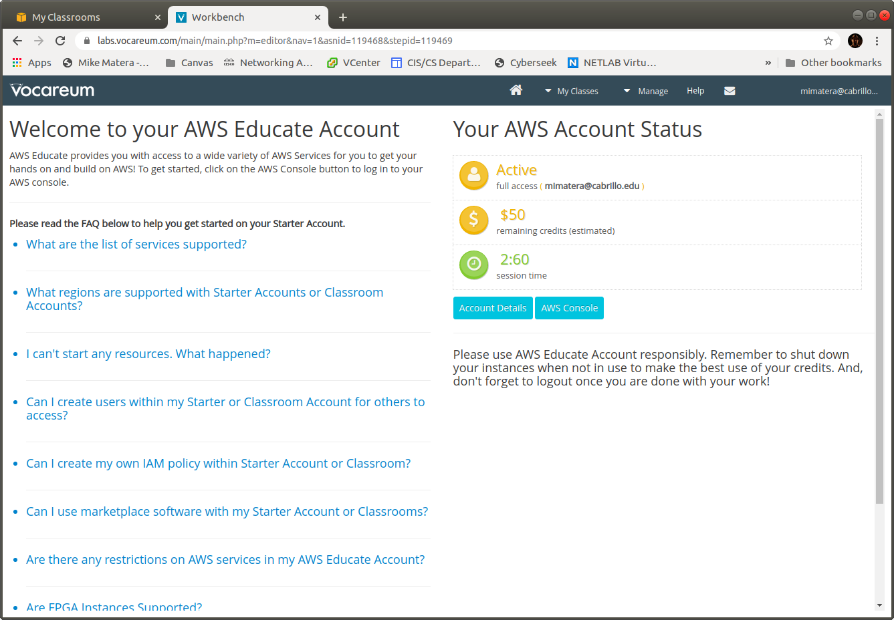
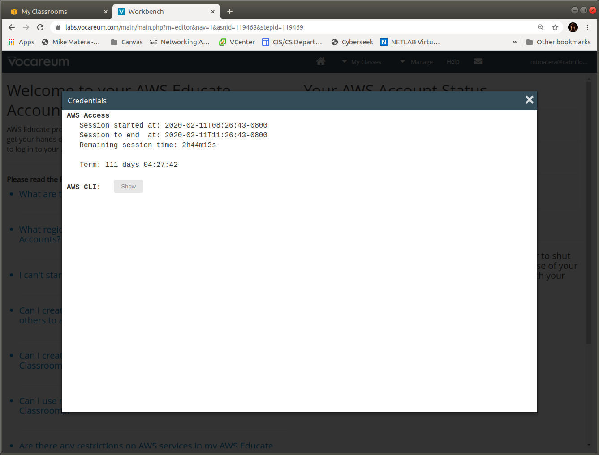

# Using the AWS Command Line 

This lab will take you through the process of getting setup with the AWS command line. The AWS command line works on Windows, Mac and Linux but instead of setting it up on your host we'll make it work on your Vagrant VM. When you have the CLI setup you'll be able to do all AWS tasks using the command line, instead of the web GUI. 

## Step 1: Install the AWS CLI on Your Vagrant VM 

The AWS command line tool is not installed by default on your Vagrant VM. Use `apt` to install it:

```bash
$ sudo apt install awscli 
``` 

After that you should have the `aws` command.

## Step 2: Get Your Access Key

The AWS command needs to have access to your account. This is done using secret keys that you can download from Amazon. Login to AWS Educate and get to the home screen shown below: 



Click the "Account Details" button which raises a popup: 



The instructions tell you to copy-and-paste the revealed text into `~/.aws/credentials`. Instead place the contents into a file called `aws_credentials.txt` next to your `Vagrantfile`. That way the credentials are still present even if you delete your VM. 

## Step 3: Install the Access Key 

Connect to your VM using the `vagrant ssh` command. From the command line of your VM copy the contents of your credentials file to `~/.aws/credentials`:

```bash
vagrant@ubuntu-bionic:~$ mkdir ~/.aws
vagrant@ubuntu-bionic:~$ cp /vagrant/aws_credentials.txt ~/.aws/credentials 
```

You now need to set a default region. 

## Step 4: Set the Default Region 

All AWS resources are regional, they exist in a real datacenter somewhere. Normally you can create resources in any region, however with AWS Educate you can only create resources in the N. Virginia datacenter, code named `us-east-1`. Use the command below to set this to your default region.

```bash 
vagrant@ubuntu-bionic:~$ aws configure 
AWS Access Key ID [****************VZID]: 
AWS Secret Access Key [****************/nO/]: 
Default region name [us-west-2]: us-east-1
Default output format [None]: 
```

Now it's time to test! 

## Step 5: Test the Connection 

If everything is done correctly you should be able to view your Amazon VMs. Of course, you haven't created any yet, so you'll see an empty list. 

```bash
vagrant@ubuntu-bionic:~$ aws ec2 describe-instances 
{
    "Reservations": []
}
```

The code above is what you *should* see. If you see the error message below check your work:

```
An error occurred (UnauthorizedOperation) when calling the DescribeInstances operation: You are not authorized to perform this operation.
```

## Optional: Ansible Configuration 

You should have a playbook started by following the instructions in the [Custom Splash Screen](custom_splash_screen) lab. Add the following play to copy the credentials in `/vagrant/aws_credentials.txt` from your shared directory in Vagrant and automatically set the region to `us-east-1`. 

Add the following play:

```yaml 
- hosts: all
  name: Install AWS credentials
  vars:
    ansible_python_interpreter: auto
  tasks:
    - name: Installing the AWS command line
      become: true
      apt:
        pkg:
        - awscli
    - name: Create the ~/.aws directory
      file:
        path: /home/vagrant/.aws
        state: directory
        mode: '0700'        
    - name: Installing AWS credentials 
      copy:
        src: /vagrant/aws_credentials.txt
        dest: /home/vagrant/.aws/credentials
        mode: '0600'
    - name: Set the AWS region
      blockinfile:
        path: /home/vagrant/.aws/config
        create: yes
        mode: '0644'
        block: |
          [default]
          region = us-east-1
```

## Turn In 

Turn in a screenshot showing the output of `aws ec2 describe-instances`.
