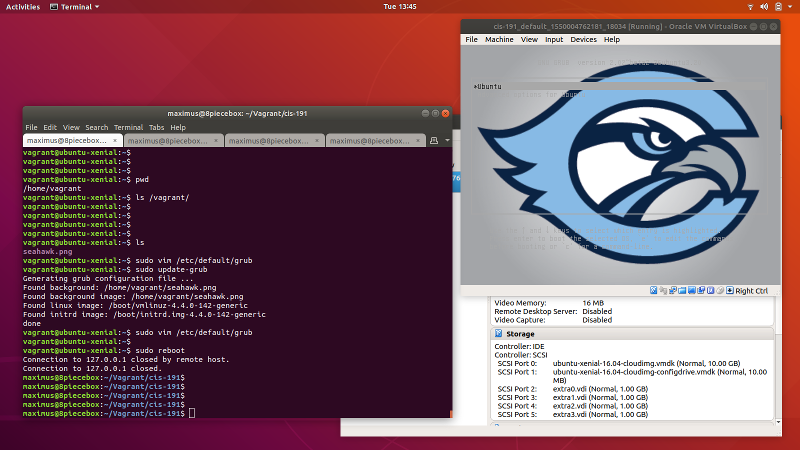

# Lab: Make a Custom Boot Splash Screen 

Spruce up the boot process on your VM by selecting a custom splash image. The [Ubuntu documentation](https://help.ubuntu.com/community/Grub2/Displays) shows you how. Note that not all pictures can be made into splash screens there are requirements on the resolution and file types. 

## Step 0: Find an Image 

GRUB doesn't support all images. It supports most `jpeg` and `png` files. There's a maximum resolution so you have to find a small image (use 640x480 or less), or use a paint program like [the GIMP](http://www.gimp.org) to resize an image you like. 

When you have an image file transfer it to your vagrant box. 

> Tip: Copy the image into /root on your box.

## Step 1: Find the Configuration Files 

There are two places where GRUB is configured:

  * `/etc/default/grub` - GRUB configuration settings
  * `/etc/default/grub.d/*` - Configuration settings that override 
  
Settings in `/etc/default/grub` must be legal BASH assignments. Here are some examples:

```bash
GRUB_DEFAULT=0
GRUB_HIDDEN_TIMEOUT=0
GRUB_HIDDEN_TIMEOUT_QUIET=true
GRUB_TIMEOUT=0
GRUB_DISTRIBUTOR=`lsb_release -i -s 2> /dev/null || echo Debian`
GRUB_CMDLINE_LINUX_DEFAULT="console=tty1 console=ttyS0"
GRUB_CMDLINE_LINUX=""

# Uncomment to enable BadRAM filtering, modify to suit your needs
# This works with Linux (no patch required) and with any kernel that obtains
# the memory map information from GRUB (GNU Mach, kernel of FreeBSD ...)
#GRUB_BADRAM="0x01234567,0xfefefefe,0x89abcdef,0xefefefef"
```

The pound sign (`#`) is the comment character in BASH so options that are after a `#` are ignored.

## Step 2: Find Vagrant's Pluggable Configuration 

The `/etc/default` directory has a place for custom GRUB configuration instructions. Configuration files in `/etc/default/grub.d` override the defaults in `/etd/default/grub`. Check the contents of `/etc/default/grub.d`

```bash
$ ls -la /etc/default/grub.d
total 12
drwxr-xr-x 2 root root 4096 Feb  4 14:12 .
drwxr-xr-x 3 root root 4096 Feb  4 14:12 ..
-rw-r--r-- 1 root root  378 Feb  4 14:12 50-cloudimg-settings.cfg
``` 

The `50-cloudimg-settings.cfg` file contains settings placed there by the software that created the official Ubuntu box. Here's what's in the file: 

```bash
# Cloud Image specific Grub settings for Generic Cloud Images
# CLOUD_IMG: This file was created/modified by the Cloud Image build process

# Set the recordfail timeout
GRUB_RECORDFAIL_TIMEOUT=0

# Do not wait on grub prompt
GRUB_TIMEOUT=0

# Set the default commandline
GRUB_CMDLINE_LINUX_DEFAULT="console=tty1 console=ttyS0"

# Set the grub console type
GRUB_TERMINAL=console
```

We don't need these settings so simply delete the file: 

```bash
$ sudo rm /etc/default/grub.d/50-cloudimg-settings.cfg
```

## Step 3: Change the Boot Timeout

Change the timeout configuration parameter in `/etc/default/grub` to 30 seconds by updating the `GRUB_TIMEOUT` value: 

```bash
GRUB_TIMEOUT=30
```

> IMPORTANT: The must be **no space** before or after the equal sign.

Now tell GRUB to show the menu during the timeout by setting `GRUB_TIMEOUT_STYLE` parameter TO `menu`:

```bash
GRUB_TIMEOUT_STYLE=menu
```

> NOTE: There's nothing on the right of the equal sign. 

When you complete the change run the command:

```
$ sudo update-grub 
```

Now reboot your VM while watching the console in VirtualBox. You should see the countdown timer. It'll be a bit boring until you get a nice splash screen. 

```
$ sudo reboot 
```

## Step 4: Configure the Background Image 

Edit `/etc/default/grub` and add the location of your picture:

```bash
# Change /root/seahawk.png to your file.
GRUB_BACKGROUND=/root/seahawk.png
```

Rerun `update-grub` and check the output. If your image is recognized you will see its name in the output like this: 

```bash
$ sudo update-grub
Generating grub configuration file ...
Found background: /root/seahawk.png
Found background image: /root/seahawk.png
Found linux image: /boot/vmlinuz-4.4.0-142-generic
Found initrd image: /boot/initrd.img-4.4.0-142-generic
```

> WARNING: Images cannot be loaded from the /vagrant directory. 

Finally reboot your VM and look for your picture.



## Optional: Start a Playbook 

This lab customizes your VM. What if you wanted to do this customization 10 times, or 100 times? It would be very time consuming. Also, if you accidentally break your VM and have to do a `vagrant destroy` your cool splash screen will be lost. [Ansible](https://docs.ansible.com/ansible/latest/user_guide/index.html) is a system that automates customization tasks on Linux. 

Start a playbook by putting a file called `playbook.yaml` next to the `Vagrantfile` in the cis-191 directory that you created last week. 

> The Vagrantfile has been updated. Please re-download the newest copy. 

The `playbook.yaml` should start with the following content: 

```yaml 
---
- hosts: all
  become: true
  tasks:
    - name: Download the Cabrillo logo. 
      get_url:
        url: https://www.cabrillo.edu/services/marketing/images/new_cabrillo_logo_1_003.jpg
        dest: /root/cabrillo.jpg
        mode: '0644'
    - name: Remove file 50-cloudimg-settings.cfg
      file:
        path: /etc/default/grub.d/50-cloudimg-settings.cfg
        state: absent    
    - name: Update GRUB timeout to 10 seconds.
      lineinfile:
        path: /etc/default/grub
        regexp: '^GRUB_TIMEOUT='
        line: GRUB_TIMEOUT=10
    - name: Update GRUB hidden timeout to empty
      lineinfile:
        path: /etc/default/grub
        regexp: '^GRUB_TIMEOUT_STYLE='
        line: GRUB_TIMEOUT_STYLE=menu
    - name: Set the GRUB splash screen.
      lineinfile:
        path: /etc/default/grub
        regexp: '^GRUB_BACKGROUND='
        line: GRUB_BACKGROUND=/root/cabrillo.jpg
    - name: Run update-grub to reflect changes. 
      shell: update-grub
```

When you create your VM again from scratch the play book will be run: 

```bash
$ vagrant destroy -f 
$ vagrant up 
```

If you want to run your playbook without destroying your VM run the command below while the VM is running:

```bash
$ vagrant provision 
```

## Turn In

Turn in a screenshot of your custom splash screen.
