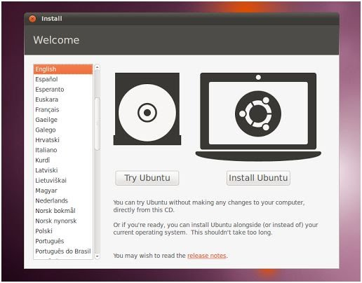
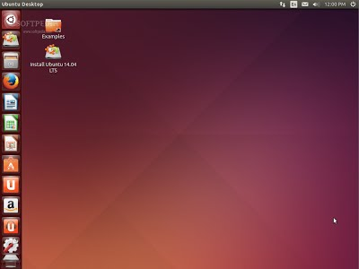

# Disaster Recovery 

Two ways to destroy Ubuntu. In this lab you will recover from two common disasters that will prevent Ubuntu from booting.

## Part 1: Broken GRUB Configuration

In this part you will render your VM unbootable by destoying `/etc/grub/grub.cnf`. This will give you practice using GRUB to boot your VM. 

### Step 1: Break GRUB 

Copy and paste these commands into your terminal:

```
$ sudo su
# mv /boot/grub/grub.cfg /boot/grub/grub.cfg.$RANDOM; reboot
```

Your machine will reboot but the GRUB configuration has been renamed to a random filename inside of the boot directory. This will prevent Ubuntu from starting.

### Step 2: Use GRUBs menu to save your bacon

When you reboot grub cannot proceed. You will be stuck at the menu. 

```
grub> ls 
```

Using the ls command find the disk with a /boot directory. 

```
grub> ls (hd0,msdos1)/ 
```

Now we can try to load Linux manually.

```
grub> linux (hd0,msdos1)/vmlinuz
grub> initrd (hd0,msdos1)/initrd.img
grub> boot
```

### Step 3: Getting Linux past initramfs

You did not tell the Linux kernel where to find it's root filesystem. This caused Ubuntu to get stuck in the initial RAM disk (initramfs). From here you have a limited set of commands that you can use to get the system back to a functional state. First you will need to check and mount the root filesystem.

```
(initramfs) mkdir /mnt
(initramfs) mount /dev/sda1 /mnt # It's safe to ignore the warnings
(initramfs) cd /mnt/boot/grub
(initramfs) ls
```

What has grub.cfg been renamed to? Copy GRUB's configuration back to the original name (make sure you save the mangled copy, you will need to turn it in):

```
(initramfs) cp grub.cfg.XXXXXXX grub.cfg
(initramfs) reboot
```

You will turn in the file for credit.

## Part 2: Delete GRUB 

In this part we'll be deleting GRUB completely and using recovery to reinstall it. This can happen when you install or recover Windows on a dual-boot computer. Windows is not careful to avoid Linux and loves thrashing it. 

Before you begin download an Ubuntu ISO image that you will use for recovery: 

> [ubuntu-16.04.5-desktop-amd64.iso](http://releases.ubuntu.com/16.04.5/ubuntu-16.04.5-desktop-amd64.iso)

The ISO image must be available to VirtualBox. There are instructions here: 

> [How do I Install Ubuntu on a VirtualBox Client from an ISO Image?](https://askubuntu.com/questions/64915/how-do-i-install-ubuntu-on-a-virtualbox-client-from-an-iso-image)

### Step 1: Delete GRUB

The 'dd' command is a low level copy utility. We're going to use it to blow away the MBR. First, let's save a copy.

```
# sudo dd if=/dev/sda of=/home/vagrant/grub.backup.img count=218 bs=1
```

Now let's zero the whole thing. BE CAREFUL. Don't kill more than the MBR bootstrap code or you will be sorry!

```
# sudo dd if=/dev/zero of=/dev/sda count=218 bs=1
# sudo reboot
```

You are now stuck without GRUB. Because there's nothing in the MBR VirtualBox will no longer be able to boot your hard disk. Now connect the ISO image to boot Ubuntu Desktop. 

### Step 3: Boot onto the LiveCD 

You can use the Ubuntu Desktop LiveCD to rescue your system. If VirtualBox found your CD it should boot into this menu:



Select the "Try Ubuntu" option. This gives you a full Ubuntu Desktop environment that you can use to save yourself. When you see the Ubuntu desktop (pictured) click the icon in the upper left corner and search for "Terminal". Select the Terminal program.



When you have a terminal you must execute the following commands:

```
$ sudo mount /dev/sda1 /mnt
```

The commands above make your hard disk available for recovery. Next you will have to add a virtual fileystems that will assist in recovery:

```
$ sudo mount -t devtmpfs devfs /mnt/dev 
$ sudo mount -t proc proc /mnt/proc
```

Now you will use the `chroot` command to shift the root directory of the current shell.

```
$ sudo chroot /mnt
```

You are now using your hard disk as a root filesystem. This enables `grub-install` to repair your hard disk:

```
# grub-install /dev/sda 2>&1 | tee /home/vagrant/grub.log
```

Now run this commands to record that you have gotten to this point and finally reboot the machine.

```
# mount > /home/vagrant/mount.log
# exit
$ sudo umount /mnt
$ sudo reboot
```

After you reboot you should have the following files in your VM:

```
/home/vagrant/grub.backup.img
/home/vagrant/grub.log
/home/vagrant/mount.log
```

You will submit them for credit.

## Turn In 

You should have the following files in your VM:

  * `/boot/grub/grub.cfg.XXXXXXX` - The renamed GRUB file from part 1
  * `/home/vagrant/grub.backup.img` - The backup you made in part 2
  * `/home/vagrant/grub.log` - The logfile from `grub-install`
  * `/home/vagrant/mount.log` - The mount points from part 2
  
Submit the files on Canvas.
