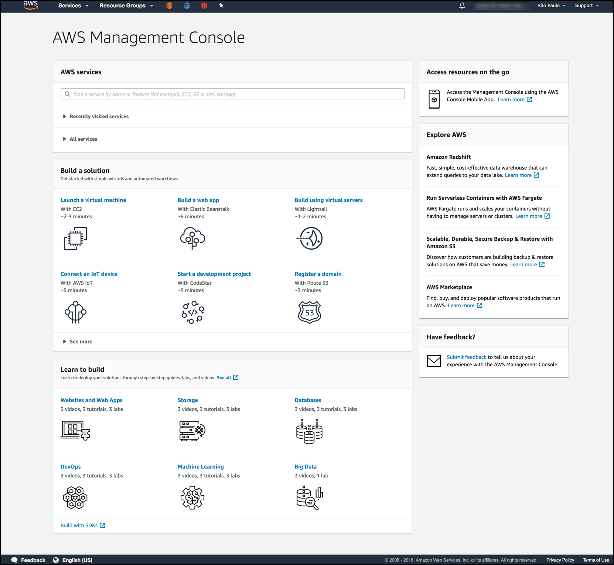

# Login to AWS Educate

In this class you will learn how to use a diversity of Linux infrastructure. Amazon Web Services has a program, called [AWS Educate](https://aws.amazon.com/education/awseducate/), where you can receive free credit towards many AWS products. Unlike the free credit that you get for signing up with AWS, getting your credit through class means you don't need a credit card. 

## Step 1: Check Your Email

You should be receiving an email welcoming you to AWS Educate. I'm not sure when it will arrive. Don't forget to check spam. 

## Step 2: Follow the Instructions

Follow the instructions in your email to get your credit. If you are successful you should be able to access your AWS management console. Take a screenshot it should look something like this:

## Turn In

Turn in your screenshot.
