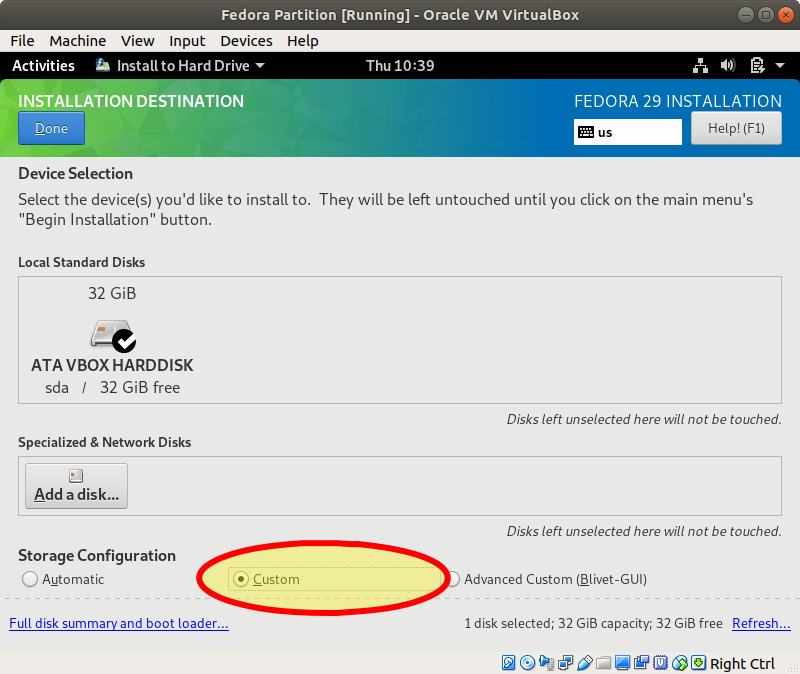

# Partition Fedora on Installation 

In this lab you will redo the installation of Fedora that you did in the [Install Fedora on VirtualBox](install_fedora_on_virtualbox.md) lab with custom partitioning.

## Introduction 

The best time to partition the system disk is during installation. Installers have GUIs to help you with the process. In the lab you will create a Fedora workstation VM with the following properties: 

  * 2 processors (or more if you have them)
  * 4 GB of memory 
  * One 32G disk
  
The disk will be partitioned like so: 

| Mount Point | Capacity** | Type | 
| --- | --- | --- | 
| /boot | 1 GiB | ext4 Filesystem | 
| (none) | 4 GB | Swap space | 
| / | 16 GiB | ext4 Filesystem | 
| /var/www | 11 GiB | btrfs Filesystem | 

***Capacity numbers are approximate.* 

## Step 1: Start the Installer 

Follow the directions in the previous lab to get the installer started. Select the system disk in the installer. 

## Step 2: Custom Partitioning

Select "Custom" in the Storage Configuration section as shown: 

## Step 3: Use the GUI to Add Partitions

The walkthrough in class shows you how to do this. 

## Step 4: Install the System 

Continue the installation and boot Fedora to the desktop. Use the terminal to gather information to submit for this assignment. 

## Turn In 

  * A screenshot of the output of the `df` command called `df_output.png`
  * A screenshot of the `/etc/fstab` file called `fstab.png`

Submit the files on Canvas.
