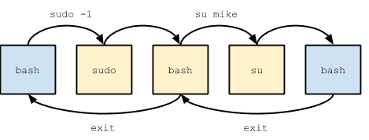

# System Administration 

The most essential knowledge that a system administrator must have is how to change their identity. In this lesson you will learn how to do that and why it's important.

**Commands**

  * sudo
  * su
  * whoami
  * ps
  * pstree

**Configuration**

  * /etc/sudoers

**Further Reading**

  * [http://www.linux-mag.com/id/2195/](http://www.linux-mag.com/id/2195/)
  * [Deciphering Manual Pages](deciphering_manual_pages)

## Sudo and The Linux Process Tree 


Linux is a program. It's job is to run other programs. When a program is running it's called a process. Each process runs on behalf of the user that executed it. It's said to be owned by that user. The identity of the user determines what that process is able to do. Try executing the following command on Ubuntu:

```
wc -c /boot/System.map*
```

The output should be something like this:

```
$ wc -c /boot/System.map*
wc: /boot/System.map-3.13.0-55-generic: Permission denied
   0 total
```

The `wc` command runs on behalf of the user that executed it. On Ubuntu normal users are not allowed to read these files so `wc` fails with an error. If you use the `sudo` command to run `wc` as root the result is different:

```
$ sudo wc -c /boot/System.map*
3390881 /boot/System.map-3.13.0-55-generic
3390881
total
```

Like other programs the sudo program takes arguments. `sudo` interprets its arguments as another program to run as root, possibly prompting you for a password. When the `wc` command runs as root it's able to count the bytes in the files and the command succeeds.Sudo and su do not change the user of the current process, they create a new process owned by the requested user. Consider the following sequence of commands:

```
$ whoami
mike
$ sudo -i
# whoami
root
# su mike
$ whoami
mike
$ exit
# whoami
root
# exit
$ whoami
mike
```



The sequence of commands is diagramed on the right. The user "mike" starts in his own BASH shell. Executing `sudo -i` creates a new BASH shell owned by root. The original shell is still running and in the background. The su command is used to droppermissions back to a regular user. This creates yet another BASH shell running as `mike`. In order to go back to the beginning you must exit both shells by running the `exit` command twice.

### Using sudo and su 

A key difference between sudo and `su` is who's password they ask for. `su` asks for the password of the target user, the the user you've asked to become. Sudo asks for the password of the user that executed the sudo command. `sudo` is more secure because you never have to share passwords. `su` will never ask for a password when executed by root. So who has a right to use `sudo`? That's determined by the `/etc/sudoers` file. Here's the default `/etc/sudoers` file on Ubuntu:

```
# This file MUST be edited with the 'visudo' command as root.
#
# Please consider adding local content in /etc/sudoers.d/ instead of
# directly modifying this file.
#
Defaults env_reset
Defaults mail_badpass
Defaults secure_path="/usr/local/sbin:/usr/local/bin:/usr/sbin:/usr/bin:/sbin:/bin"

# User privilege specification
root ALL=(ALL:ALL) ALL

# Members of the admin group may gain root privileges
%admin ALL=(ALL) ALL

# Allow members of group sudo to execute any command
%sudo ALL=(ALL:ALL) ALL

# See sudoers(5) for more information on "#include" directives:
#includedir /etc/sudoers.d
```

Let's focus on the following line:

```
%admin ALL=(ALL) ALL
```

The anatomy of this line can be described like:

```
who where = (as_whom) what
```

In English the line reads, "Members of the admin group are able to run all commands as any user from any anyplace." In this context "from anyplace" means from anywhere on the network. When you install Ubuntu it creates a user account and places that user into the admin group. Groups are covered in a different lecture.

There are two basic forms of the `sudo` command:

```
# Run one command
sudo <command>

# Run a shell
sudo -l
```

The first form of the `sudo` command runs `<command>` as root and returns to the calling user. The second form of `sudo` runs BASH as root. When you run the second command you can run multiple commands as root until you run the exit command.

## Using ps to Find Running Programs 

The ps command shows you a snapshot of the running programs. This command shows all programs on your computer:

```
$ ps -ef
```

If you only want to see your processes from the current session:

```
$ ps -af
```

Look at every line in the output of `ps -ef`. There's a lot there. Here's a breif explanation of what the different programs are:

```
$ ps -ef
UID    PID PPID C STIME TTY     TIME CMD
root     1   0 0 Jun09 ?    00:00:05 /sbin/init
root     2   0 0 Jun09 ?    00:00:00 [kthreadd]
root     3   2 0 Jun09 ?    00:00:02 [migration/0]
root     4   2 0 Jun09 ?    00:00:03 [ksoftirqd/0]
root     5   2 0 Jun09 ?    00:00:00 [stopper/0]
root     6   2 0 Jun09 ?    00:00:09 [watchdog/0]
root     7   2 0 Jun09 ?    00:00:02 [migration/1]
root     8   2 0 Jun09 ?    00:00:00 [stopper/1]
```

The first process (PID 1) is called init (it's the program `/sbin/init` but it can be anything). Init is responsible for starting all other regular programs. It is one of two programs that have no parent (PPID = 0). The other program is `kthreadd` which appears in square brackets. The brackets tell you that the program is a part of the Linux kernel itself. These are called kernel threads and they let parts of Linux perform tasks in the background. Some threads are bound to a particular CPU, they get a slash and a number (e.g. /0, /1, etc) to indicate which one. Most processes look like these:

```
root   6429   1 0 Jun09 ?    00:00:00 /usr/sbin/sshd
ntp    6438   1 0 Jun09 ?    00:00:11 ntpd -u ntp:ntp -p /var/run/ntpd.pid -g
root   6473   1 0 Jun09 ?    00:00:00 /bin/sh /usr/bin/mysqld_safe --datadir=/
mysql   6575 6473 0 Jun09 ?    00:26:19 /usr/libexec/mysqld --basedir=/usr --dat
```

Each of these is a program.

## Using pstree 

The `pstree` command shows a text representation of the processes on your system that's shows their parent/child relationships in an easy to see way.

```
$ pstree
systemd─┬─ModemManager─┬─{gdbus}
        │              └─{gmain}
        ├─NetworkManager─┬─dhclient
        │                ├─dnsmasq
        │                ├─{gdbus}
        │                └─{gmain}
        ├─accounts-daemon─┬─{gdbus}
        │                 └─{gmain}
        ├─acpid
        ├─agetty
        ├─avahi-daemon───avahi-daemon
        ├─cgmanager
        ├─colord─┬─{gdbus}
        │        └─{gmain}
        ├─containerd───25*[{containerd}]
        ├─cron
        ├─cups-browsed─┬─{gdbus}
        │              └─{gmain}
        ├─cupsd───2*[dbus]
        ├─dbus-daemon
        ├─dnsmasq───dnsmasq
        ├─dnsmasq
        ├─dockerd───25*[{dockerd}]
        ├─fwupd─┬─{GUsbEventThread}
        │       ├─{fwupd}
        │       ├─{gdbus}
        │       └─{gmain}
        ├─gnome-keyring-d─┬─{gdbus}
        │                 ├─{gmain}
        │                 └─{timer}
        ├─irqbalance
[snipped]
```

As you can see from above `pstree` shows the process hierarchy horizontally. You can follow the parentage of each process back to init. If you give `pstree` the `-u` option it shows you when the owner of a process changes from parent to child.

## Exercises 

  - You should always be able to determine a complete path from init to the shell you're in. Use `pstree` to find your current shell and trace it's parents back to init. What user owns each process?
  - Run `sudo su` to become root and repeat the above.
