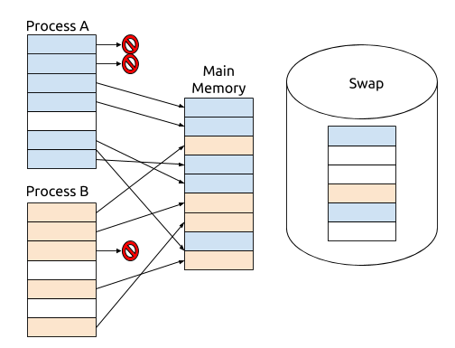

# System Monitoring and Logging 

**Commands**

  * uptime
  * top
  * powertop
  * iftop
  * vmstat
  * ss
  * lsof

**Configuration**

  * /var/log

## Introduction 

Administrators must be able to determine what the system is doing at all times. Problems with your Linux host are invisible until you reveal them with the right commands. This lecture focuses on the tools used to discover where your host's resources are being spent.

## Memory Resources 

The fundamental unit of memory to an operating system is called a *page*. When a process allocates memory it allocates it in pages. Most processors use a 4kB page size though newer processor architectures may support simultaneous use of different page sizes. To see what the page size is on your system run the command:

```
 $ getconf PAGE_SIZE 
```

Each process in Linux "sees" a completely empty memory space (or nothing but empty pages). As a process allocates new memory pages Linux finds space for those pages in main memory. The diagram below shows how two processes have their pages sprinkled throughout main memory.You can examine how much memory a process uses by looking into the /proc filesystem. For example, to see how much memory the current process is using, run the command:

```
$ cat /proc/self/status | grep Vm
VmPeak:	    6164 kB
VmSize:	    6164 kB
VmLck:	       0 kB
VmPin:	       0 kB
VmHWM:	     664 kB
VmRSS:	     664 kB
VmData:	     320 kB
VmStk:	     132 kB
VmExe:	      48 kB
VmLib:	    1944 kB
VmPTE:	      32 kB
VmPMD:	      12 kB
VmSwap:	       0 kB
```

There's a lot more information in that file, but grepping for "Vm" limits the output only to virtual memory usage. The output shows that the current memory utilization (`VmSize`) is 6164 kB (or 1514 pages). We can see what the total memory usage for the system is using by looking in the `/proc/vmstat` pseudo file: 

```
$ cat /proc/meminfo 
MemTotal:        2048172 kB
MemFree:         1275656 kB
MemAvailable:    1753384 kB
Buffers:          207528 kB
Cached:           363780 kB
SwapCached:         2092 kB
Active:           482008 kB
Inactive:         119964 kB
Active(anon):      24420 kB
Inactive(anon):    19832 kB
Active(file):     457588 kB
Inactive(file):   100132 kB
Unevictable:        3660 kB
Mlocked:            3660 kB
SwapTotal:       2097148 kB
SwapFree:        2088184 kB
Dirty:                 0 kB
Writeback:             0 kB
[snip]
```

The output shows that my system is using 772516 kB (2048172 KB total of 1275656 KB free) memory.

### Swap 



The picture on the right shows what happens when a processes on the operating system request more memory than is physically present in the system. The additional pages required can be served by Linux but the overflow goes into swap. Swap is space on the disk used to back memory. Having swap means that Linux can gracefully handle situations where there is a short-term shortage of memory. You can see how much swap is used by looking in `/proc/meminfo`

```
$ cat /proc/meminfo | grep Swap
SwapCached:            0 kB
SwapTotal:             0 kB
SwapFree:              0 kB
```

If your machine has never needed more memory than it has the swap file will be empty. Otherwise it will contains some pages. Even if you have free memory available you may still see some pages in the swap file because Linux will not swap them in until they're needed by the program that owns them. Depending on the program that might be a long while.

### CPU Resources 

The following commands are good commands to show you what your CPU is doing:

  - uptime
  - top
  - powertop
  - vmstat

Here's an example of running the uptime command:

```
$ uptime
12:29:31 up 6 days, 19:10, 3 users, load average: 0.07, 0.13, 0.09
```

The output of the command tells you when the last reboot was. This is important to know because it tells you if there's been a crash or a power failure. The load average is also a key number to understanding how busy your system is. The three numbers are the average number of runnable processes in the last

  - 1 minute
  - 5 minute
  - 15 minutes

When the number exceed the number of processors on the machine it indicates that the machine is being asked to work beyond it's peak capacity and that the scheduler is rationing time. In some cases that may be normal, but usually it means that something has gone out of control.

The `top` command shows a continuously updated view of running processes:

```
$ top
top - 12:35:14 up 6 days, 19:15, 3 users, load average: 0.19, 0.19, 0.13
Tasks: 270 total,  1 running, 269 sleeping,  0 stopped,  0 zombie
%Cpu(s): 0.8 us, 0.1 sy, 0.0 ni, 99.0 id, 0.1 wa, 0.0 hi, 0.0 si, 0.0 st
KiB Mem:  8060480 total, 7504036 used,  556444 free,  863164 buffers
KiB Swap: 5521404 total,    0 used, 5521404 free. 3783600 cached Mem
 PID USER   PR NI  VIRT  RES  SHR S %CPU %MEM   TIME+ COMMAND  
2338 root   20  0 503784 79588 66292 S 12.7 1.0 21:01.97 Xorg    
20945 mimatera 20  0  24944  1568  1076 R  6.4 0.0  0:00.01 top    
  1 root   20  0  34028  3432  1500 S  0.0 0.0  0:01.42 init    
  2 root   20  0    0   0   0 S  0.0 0.0  0:00.04 kthreadd  
  3 root   20  0    0   0   0 S  0.0 0.0  0:00.10 ksoftirqd/0
  4 root   20  0    0   0   0 S  0.0 0.0  0:33.69 kworker/0:0
  5 root    0 -20    0   0   0 S  0.0 0.0  0:00.00 kworker/0:+
  7 root   20  0    0   0   0 S  0.0 0.0  0:39.11 rcu_sched 
  8 root   20  0    0   0   0 S  0.0 0.0  0:10.65 rcuos/0  
  9 root   20  0    0   0   0 S  0.0 0.0  0:38.06 rcuos/1  
 10 root   20  0    0   0   0 S  0.0 0.0  0:09.26 rcuos/2  
 11 root   20  0    0   0   0 S  0.0 0.0  0:07.35 rcuos/3  
 12 root   20  0    0   0   0 S  0.0 0.0  0:03.32 rcuos/4  
 13 root   20  0    0   0   0 S  0.0 0.0  0:03.67 rcuos/5  
 14 root   20  0    0   0   0 S  0.0 0.0  0:03.46 rcuos/6  
 15 root   20  0    0   0   0 S  0.0 0.0  0:04.25 rcuos/7  
 16 root   20  0    0   0   0 S  0.0 0.0  0:00.00 rcu_bh   
 17 root   20  0    0   0   0 S  0.0 0.0  0:00.00 rcuob/0  
 18 root   20  0    0   0   0 S  0.0 0.0  0:00.00 rcuob/1  
 19 root   20  0    0   0   0 S  0.0 0.0  0:00.00 rcuob/2  
```

The top command is a good "first look" at what the system is doing. You can sort the output by different columns. The `vmstat` command is similar to top in that it shows you an updating view of the system's performance. With no arguments it shows you the averages since boot:

```
$ vmstat 
procs -----------memory---------- ---swap-- -----io---- -system-- ------cpu-----
 r  b   swpd   free   buff  cache   si   so    bi    bo   in   cs us sy id wa st
 1  0      0 743744  10936 213480    0    0   217    31   45   59  1  1 98  0  0
```

With the `-n` argument it continuously updates the output:

```
$ vmstat -n 1 
procs -----------memory---------- ---swap-- -----io---- -system-- ------cpu-----
 r  b   swpd   free   buff  cache   si   so    bi    bo   in   cs us sy id wa st
 1  0      0 743552  10928 213420    0    0   242    34   49   63  1  1 98  0  0
 0  0      0 743528  10928 213452    0    0     0     0   51   65  0  0 100  0  0
 0  0      0 743528  10928 213452    0    0     0     0   22   28  0  0 100  0  0
 0  0      0 743528  10928 213452    0    0     0     0   24   30  0  0 100  0  0
 0  0      0 743528  10928 213452    0    0     0     0   21   28  0  0 100  0  0
```

`powertop` is available on platforms that support power monitoring, like laptops and mobile devices. Most desktops don't support power monitoring but `powertop` still shows you what processes and devices are using power, it just doesn't tell you how much in terms of watts. `powertop` is text-menu driven.

## Files and Network Sockets 

The most important tool for monitoring files on your host is `lsof` (list open files). lsof lists all the open file handles for every process. On a busy machine its output can be thousands of lines so if you're looking for something specific you can pipe the output through grep:

```
$ sudo lsof | grep Desktop
lsof: WARNING: can't stat() fuse.gvfsd-fuse file system /run/user/1000/gvfs
   Output information may be incomplete.
bash   20704       mimatera cwd    DIR        0,36   4096  4849689 /home/mimatera/Desktop
sudo   21389         root cwd    DIR        0,36   4096  4849689 /home/mimatera/Desktop
grep   21390       mimatera cwd    DIR        0,36   4096  4849689 /home/mimatera/Desktop
lsof   21394         root cwd    DIR        0,36   4096  4849689 /home/mimatera/Desktop
lsof   21395         root cwd    DIR        0,36   4096  4849689 /home/mimatera/Desktop
```

You can find open files by user ID and other selectors. See the manual page for the full list. The `ss` command shows you the open network sockets on a host. The output of `lsof` also shows you sockets but doesn't give you specifics; `ss` does. The following command shows you all open TCP connections: 

```
$ ss -nt 
State       Recv-Q Send-Q      Local Address:Port                     Peer Address:Port              
ESTAB       0      0               10.0.2.15:22                           10.0.2.2:34884              
```

The `-l` options shows you listening sockets. Those are sockets where your host is listening for inbound connections:

```
$ ss -lntp 
State       Recv-Q Send-Q      Local Address:Port                     Peer Address:Port              
LISTEN      0      128                     *:22                                  *:*                  
LISTEN      0      128                    :::22                                 :::*                  
```

The `-p` flag says to list the programs that are listening. You can only do that for processes that you own (unless you're root).

```
$ sudo ss -lntp 
State       Recv-Q Send-Q      Local Address:Port                     Peer Address:Port              
LISTEN      0      128                     *:22                                  *:*                   users:(("sshd",pid=1315,fd=3))
LISTEN      0      128                    :::22                                 :::*                   users:(("sshd",pid=1315,fd=4))
```
