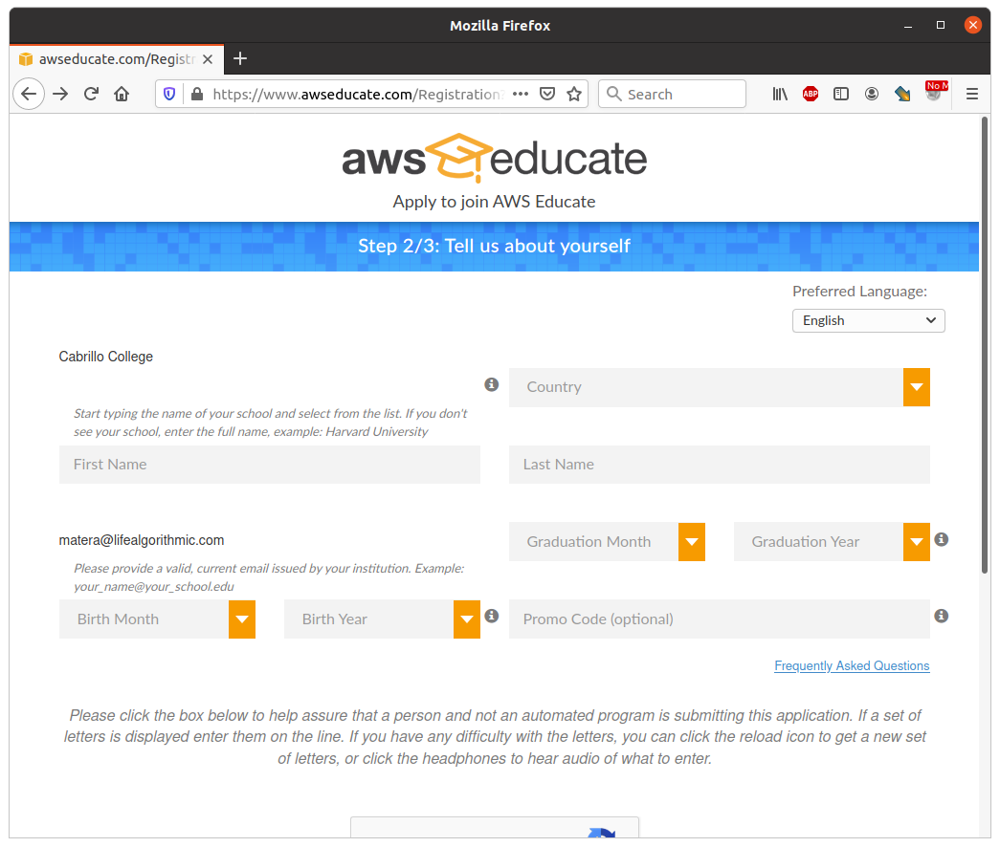
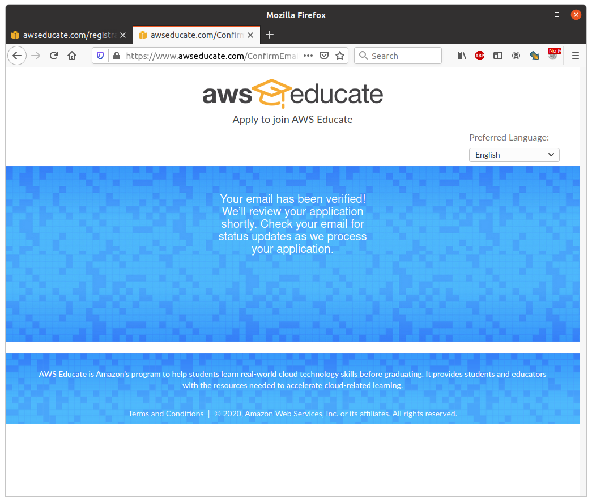
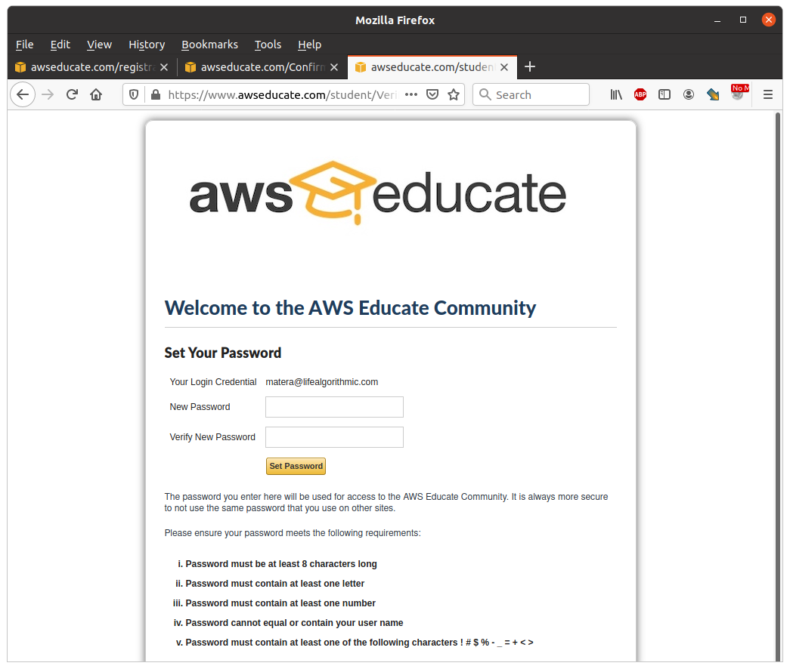
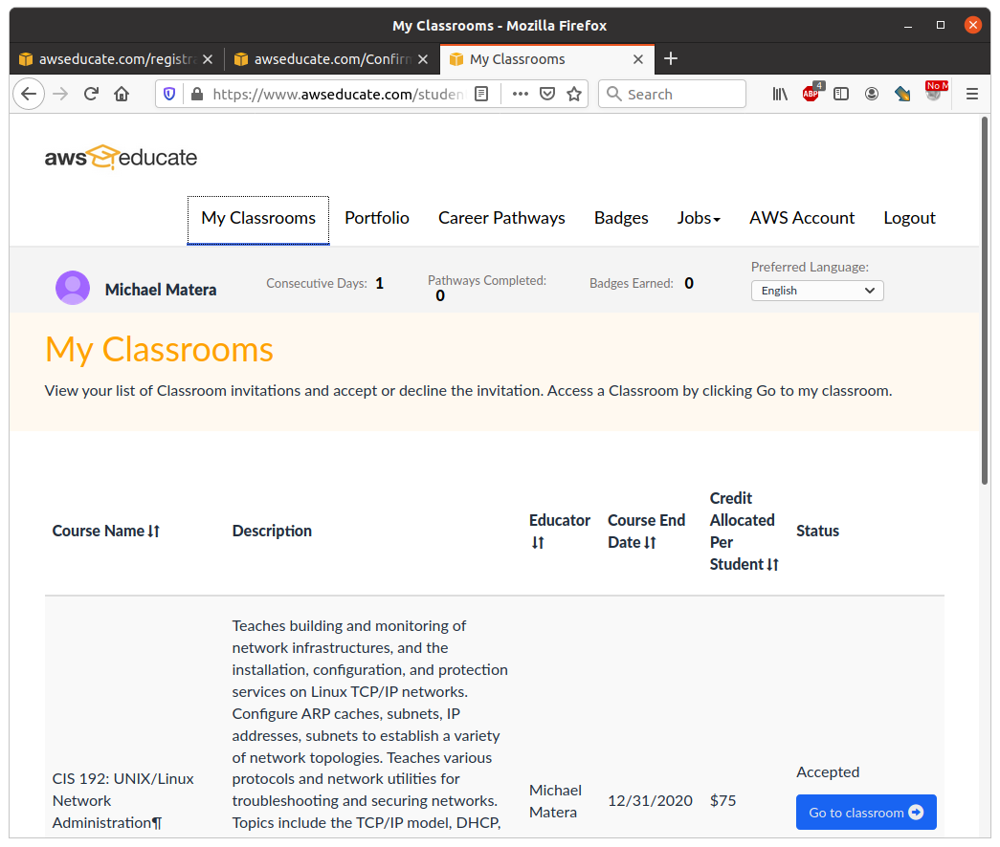
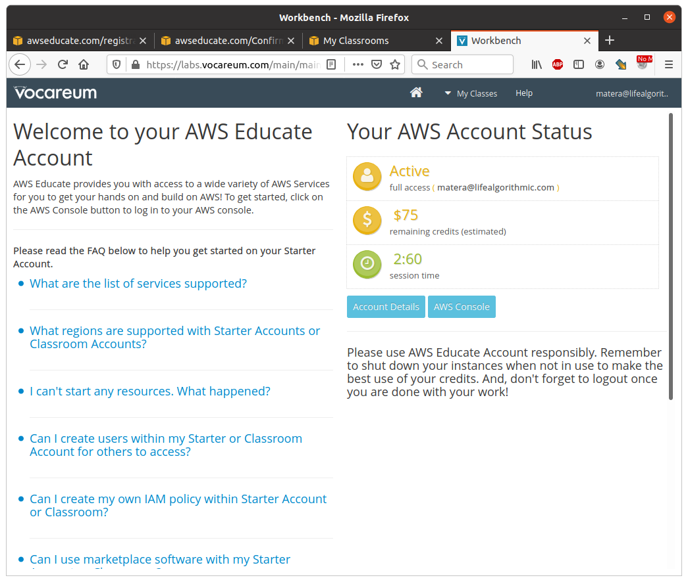
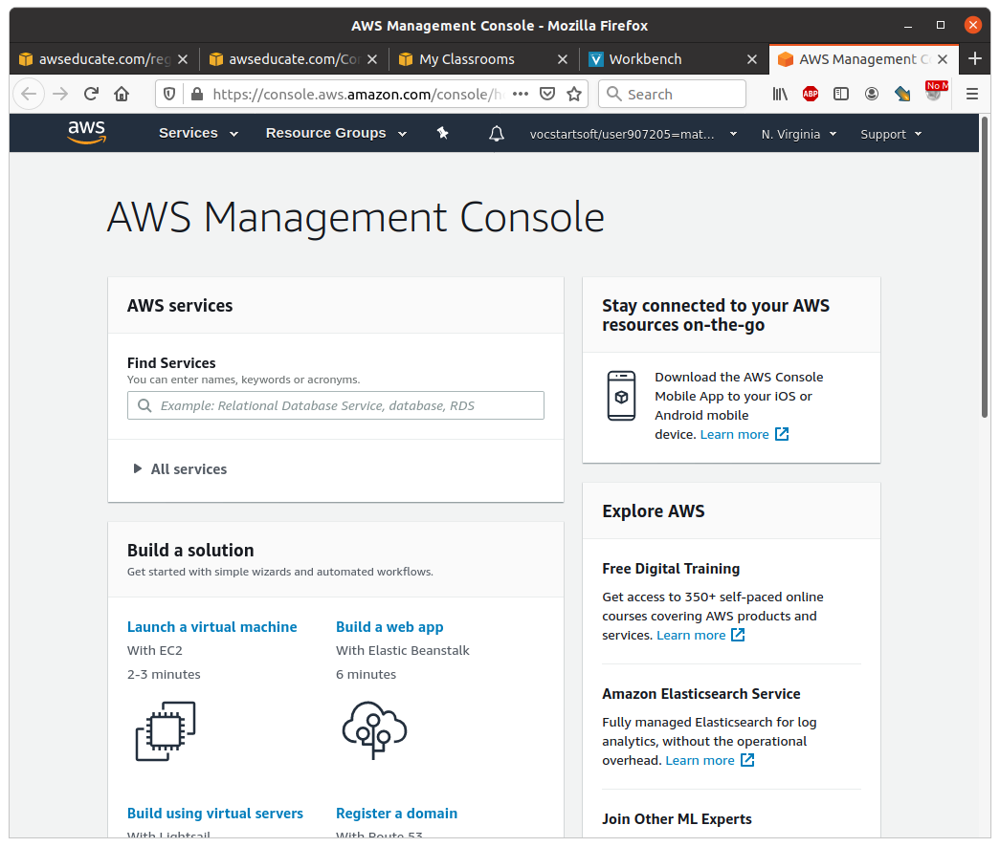

# Get AWS Educate Credit

In this lab you'll claim your AWS Educate account.

## Introduction 

Your project will be done on an AWS virtual machine. Your VM will run continuously so that you can provide on demand services. That costs money. AWS Educate is a program where you receive AWS credit for taking the course. That way it's free for you. Unlike the free credit that you get for signing up with AWS, getting your credit through class means you don't need a credit card. 

## Step 1: Check Your Email

You should have received an email welcoming you to AWS Educate. Don't forget to check spam. 

## Step 2: Sign Up

> Your graduation date must be in the future!

After you sign up you'll get an email verification. This is only to verify your email address. You are not signed up yet. 

## Step 3: Verify Your Email 

Verify your email. 

## Step 4: Create Credentials

After you verify your email address it takes a bit of time for them to process the request. If there was a problem it might take a day. Most people get the follow up email within 10 minutes. Once you have it sign up. 

## Step 5: Go to the Classroom 

After you create a login and password you'll be taken to the "My Classrooms" page. 

Click "Go To Classroom"

## Step 6: The Classroom 

The classroom page shows you an overview of your credit and details. Click the "AWS Console" link.

## Step 7: Management Console

If you are successful you should be able to access your AWS management console. Take a screenshot it should look something like this:

## Turn In

A screenshot of the AWS management console.