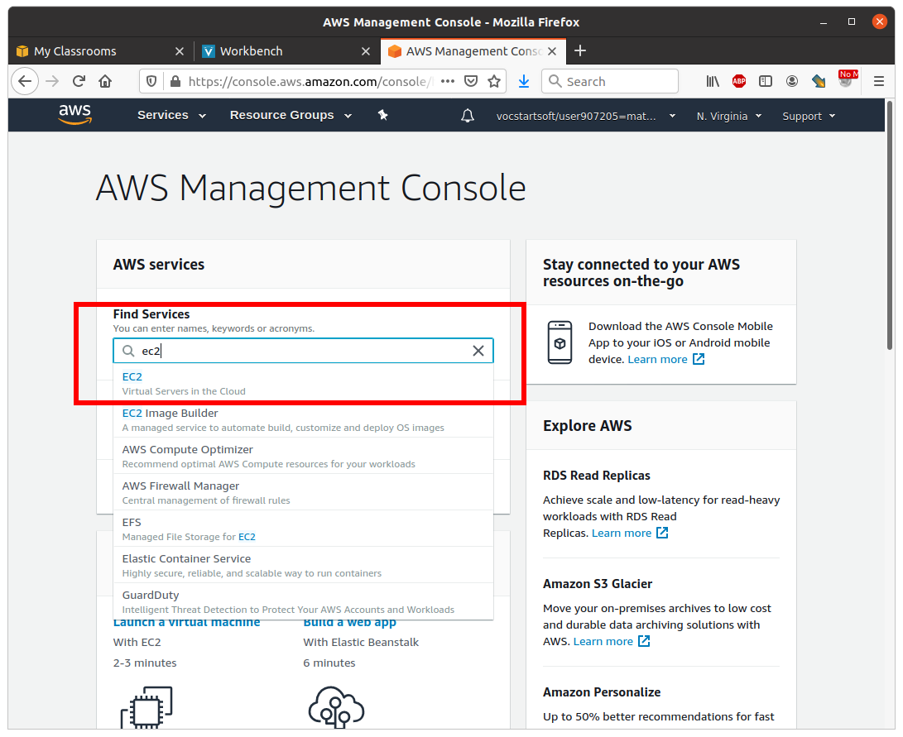
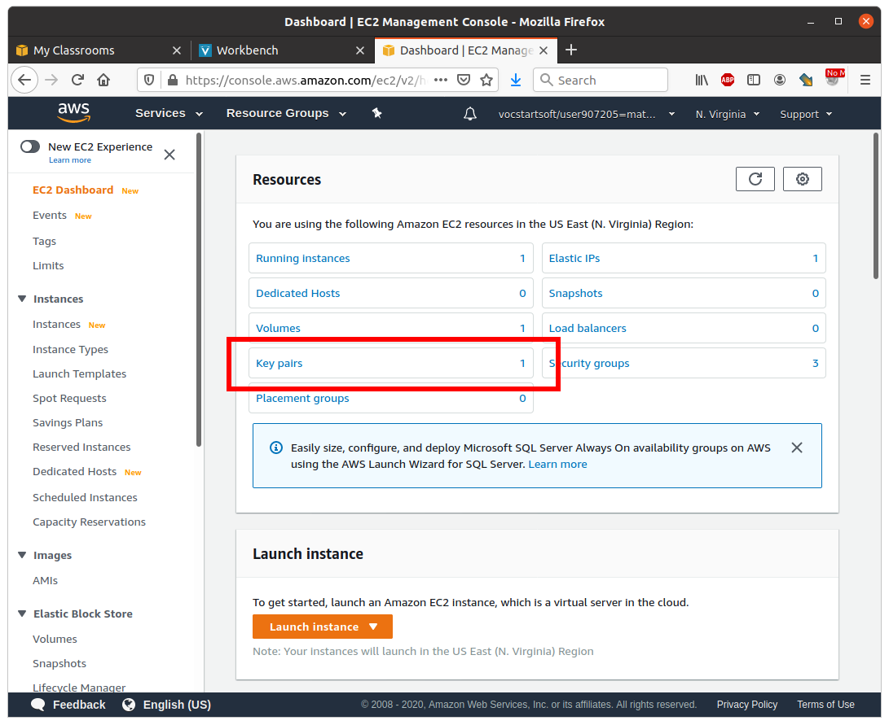
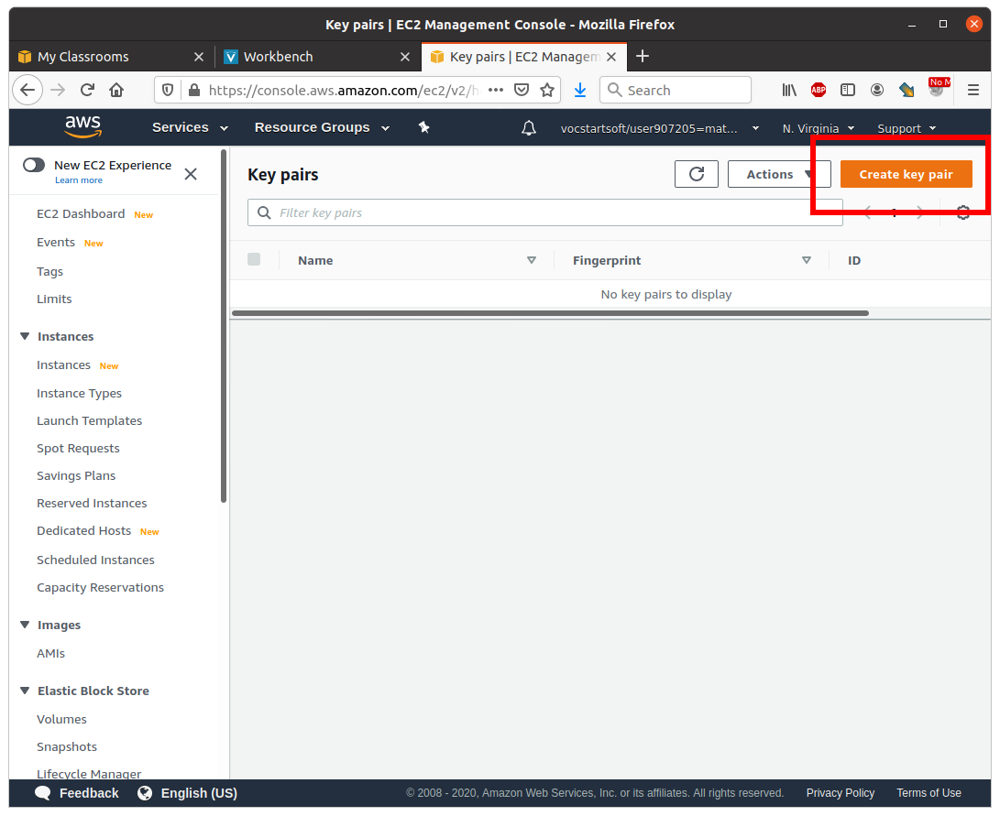
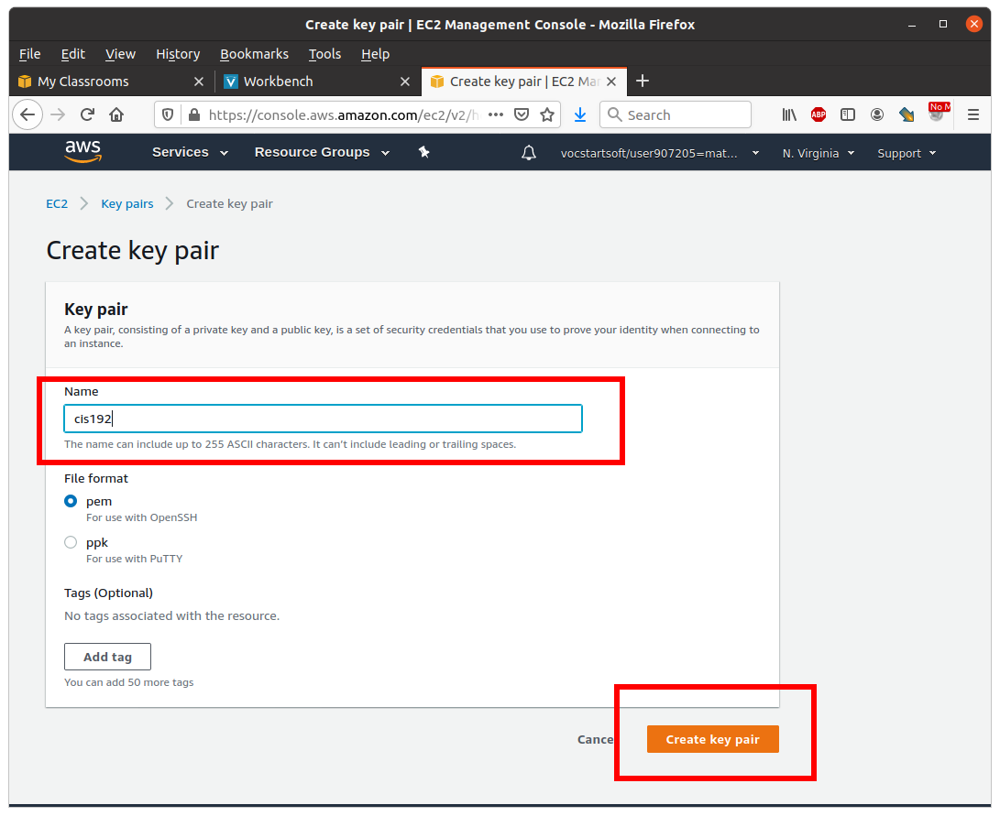
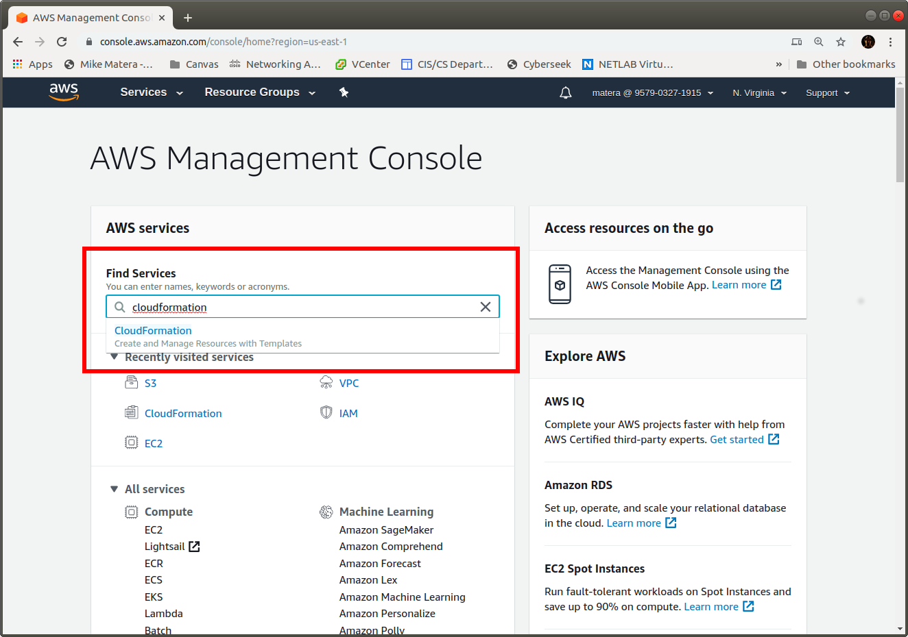
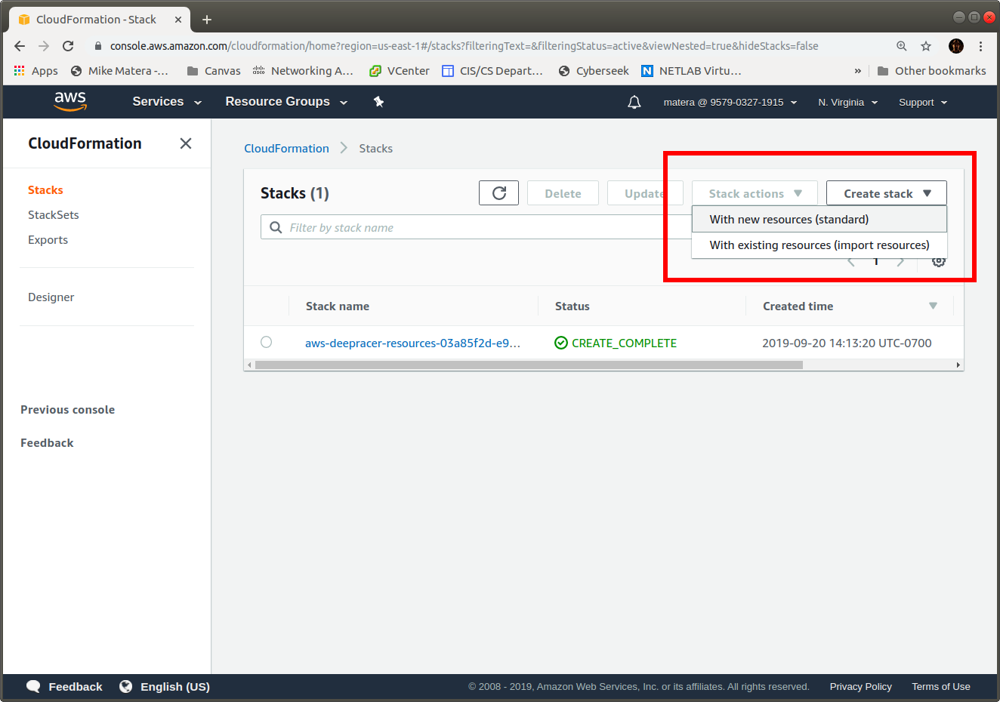
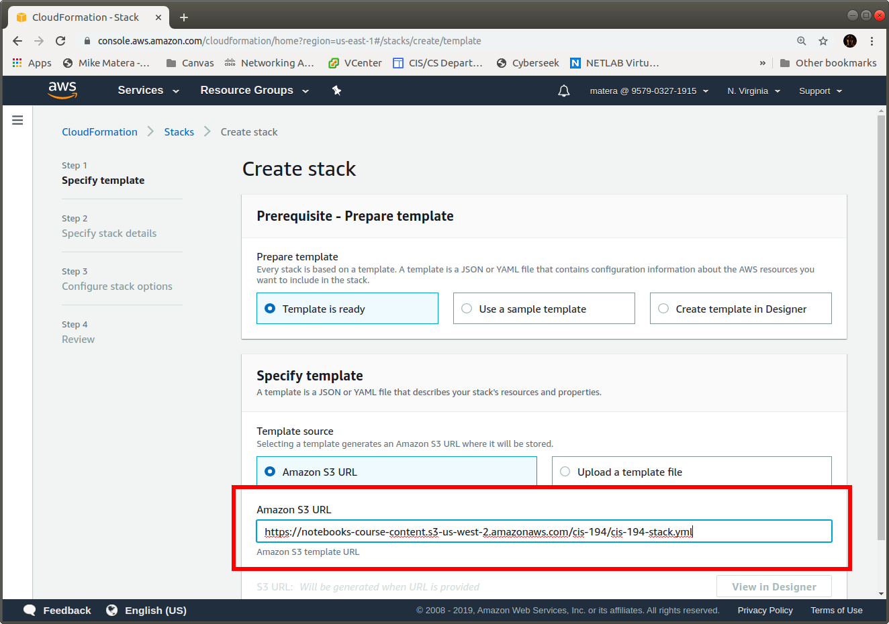
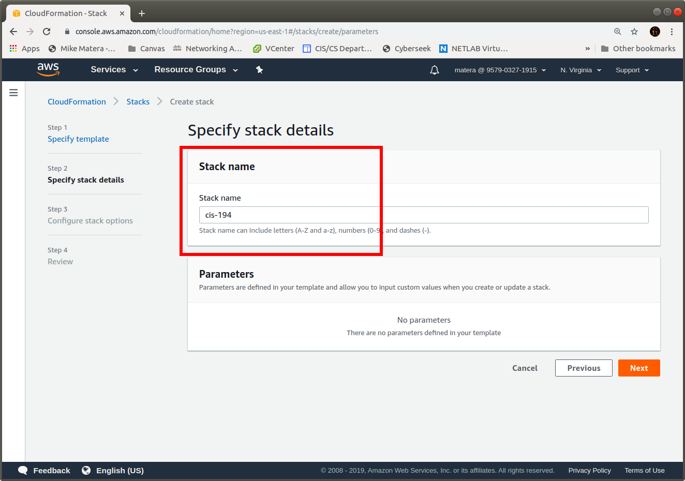
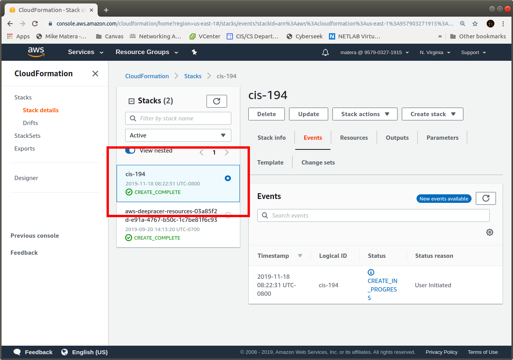

# Create an AWS Stack

This lab will guide you through the process of creating a *stack* for class using [AWS CloudFormation](https://aws.amazon.com/cloudformation/). CloudFormation is a tool that allows you to create a bunch of interconnected resources in AWS in one shot using a YAML description of the resources. **Creating this stack will cost money**. You should have free credit through [AWS Educate](https://aws.amazon.com/education/awseducate/) so that you don't have to pay out of pocket. 

> Some screenshots were created for CIS-194. Yours will be a bit different.

## Before You Begin 

Get to your AWS Console by reviewing the instructions in the [previous lab](../aws-educate/login_to_aws.md).

## Step 1: Get to EC2

Type "EC2" into the search bar and select EC2 in the results. 



## Step 2: 

Select "Key Pairs" 



## Step 3: 

Select "Create Key Pair" 



## Step 4: Name the Key Pair 

Name your key pair `cis192` and create it. 

> The name should match exactly including case. 



The new keypair will be downloaded by your browser into the Downloads folder. Move it into your ssh configuration directory and make sure that the permissions are set to forbid anyone but you from viewing or editing the file. SSH is particular about this. 

## Step 5: Get to CloudFormation 

Click the AWS logo at the top left to return to the console main page. Type "CloudFormation" into the search bar and select CloudFormation in the results. 



## Step 6: Create a new Stack 

Click the "Create Stack" button. You may not get a menu when you click it, if you do select, "With New Resources (Standard)" as shown.



## Step 7: Specify Template 

Select "Upload a Template File" and upload this file: 

```eval_rst
:download:`cis-192-stack.yaml` 
```



## Step 8: Specify Stack Name

Name your stack `cis-192` in the box. The picture shows cis-194 because I took the screenshot when I was teaching Windows. Forgive me. 



## Step 9: Finish the Stack Creation

You now have everything entered. All you have to do is click "Next" then "Create Stack" as shown. 

Select Next:


Select Create Stack:


## Turn In

It will take a couple of minutes to create the stack. When it is complete you should see so in the CloudFormation console. Take a screenshot of your completed stack similar to the one shown below: 



Turn in your screenshot on Canvas.