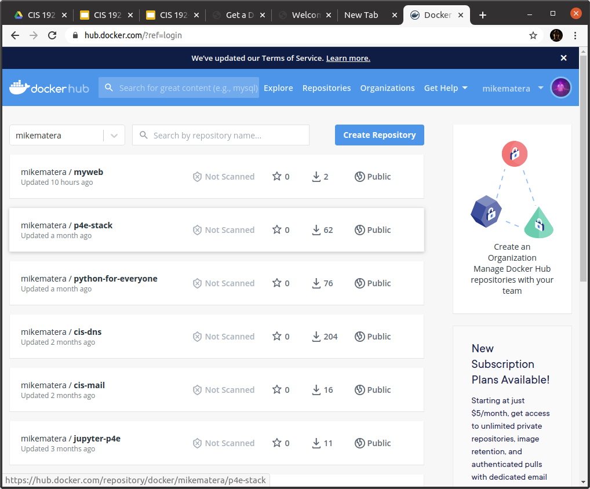

# Get a Dockerhub Account 

Container images live in a registry. Docker comes pre-configured to use the [Docker Hub](https://hub.docker.com/) registry. In this lab you will get a free Docker Hub account where you can push your built images. 

> If you already have a Docker Hub account you can skip to step two of this lab. 

## Step 1: Sign Up 

Sign up for Docker Hub using this link: 

> [https://hub.docker.com/signup](https://hub.docker.com/signup)

## Step 2: Create a Repository 

Sign in with your new account and from your home page press the "Create Repository". Give your repository the name "myweb" and any description you like. Press "Create"

You should now see your repository listed on your home page:



## Step 3: Connect Your Local Machine 

Your development environment has to be authenticated with your Dockerhub account so that you can *push* images up to Dockerhub. Docker makes that easy, just run:

```
$ docker login
```

The command will ask you for your Dockerhub username and password. Once complete you will be able to use the `docker push` command. 

## Turn In 

Take a screenshot of your Docker Hub home page and submit it on Canvas. 

