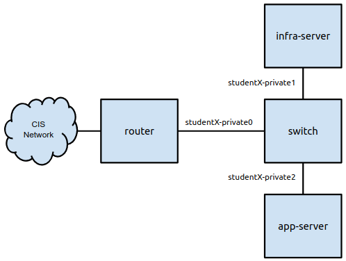

# Milestone 1: Get Connected 

The purpose of this project milestone is to get you ready for this class.

## Introduction 

In this milestone you will login to your Ubuntu router VM and give it a static IP address. The address you use should be derived from the private network number you have been assigned. 

## Your Network 

Your VMs are networked together according to the following diagram:



Your "student" number is important. You will have a pair of static IP addresses (one IPv4 and one IPv6) address derived from your network number.

## Give Your Router a Static IP Address 

Your router will need a static IP address to be the gateway for the rest of your network. You must give static IPv4 and IPv6 address to `ens192`. The static IP address is derived from your private network number. You can find your private network number in VMware. The network number will be visible in the summary tab of the web interface. The picture below shows the location:


You network number is the "student" number circled. It's the same as your original folder number. Set the IPv4 information on Ubuntu's `ens192` as follows:

## Set a Private IP Address on ens192

IPv4:
 * Address: 172.19.192.X (Where X is your network number). 
 * Netmask: 255.255.0.0 
 * Gateway: 172.19.0.1 
 * Nameservers: 2607:f380:80f:f425::252 and 2607:f380:80f:f425::253 

IPv6:
 * Address: 2607:f380:80f:f192::X (Where X is your network number)
 * Netmask: 64

Do not set the gateway on IPv6. It's done automatically. Test your configuration using the following commands:

```
$ ping www.google.com
$ ping6 www.google.com
```

## Set a Private IP Address on ens224

Now you can set an IP on the private Ethernet interface. The one that faces inward. That address should be: 

IPv4:
 * Address: 10.192.0.1 
 * Netmask: 255.255.0.0 

Everyone will have the same IP address. That's okay because the internal network is private. 

## Submit 

When you have your IP addresses setup run the following command:

```
$ ip addr
```

Submit a screenshot of the command on Canvas to achieve the milestone.