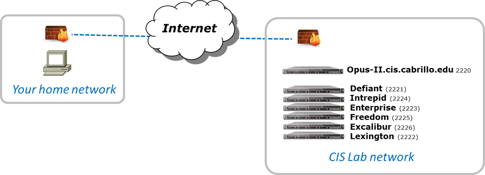

# Lab 1: Scavenger Hunt

In this lab you go on an electronic scavenger hunt to collect various items from different systems. These systems can be accessed remotely via a network connection. You will use the `ssh` command to login into each system and then use the Lesson 1 commands to answer each question. Once you correctly answer all the questions you will receive the scavenger hunt item for that system. Be sure and read everything below before starting the lab.

## UNIX/Linux Systems

The following systems will be used for this lab. **It is very important to start on Opus-II**. Everyone will take a different path through the remaining systems. Use the `scavenge` command (or just type `sc` ) on Opus-II to find the next system to visit. Remember, every student will take a different route.

| System name | Port | Action to take |
| --- | --- | --- |
| **Opus-II** | 2220 | The scavenger hunt starts on Opus-II by entering the `scavenge` (or `sc` ) command. |
| **Defiant** | 2221 | Collect a star |
| **Enterprise** | 2223 | Collect a movie |
| **Excalibur** | 2226 | Collect a dog breed |
| **Freedom** | 2225 | Collect a book |
| **Intrepid** | 2224 | Collect a fruit |
| **Lexington** | 2222 | Collect a musical instrument |

**The order of the systems above is NOT the order you will visit them**. Always use the `scavenge` command to learn the next system to visit. You must answer all the questions correctly on a system before you are shown the next system to visit.

## Simplified Network Map

## FIXME: Preparation and getting help

- Review Lesson 1 slides, especially the module titled "First Commands":
[http://simms-teach.com/docs/cis90/cis90lesson01.pdf](http://simms-teach.com/docs/cis90/cis90lesson01.pdf)
- Read the Howto on how to log into Opus-II:
[http://simms-teach.com/howtos/146-opus-access.pdf](http://simms-teach.com/howtos/146-opus-access.pdf)
- Watch Benji do part of this lab assignment (a little out of date but still helpful):
[Getting Started](http://www.3cmediasolutions.org/privid/14488?key=e985e92d89d082583138dc08f1f2f64c9ff9741c)[Submitting](http://www.3cmediasolutions.org/privid/14743?key=30106813260dab1e25612455be753dd8bd05b4c3)
- Register and check the forum for discussions on this lab:
[http://opus-ii.cis.cabrillo.edu/forum/](http://opus-ii.cis.cabrillo.edu/forum/)

- For additional help work the lab with a tutor. Click the "Tutors" link at the top of the my website: [https://simms-teach.com/](https://simms-teach.com/)

## Step 1 - Log into Opus-II

Use Putty on Windows or the terminal application on Mac or Linux to log into Opus-II:

- **Hostname** : opus-ii.cis.cabrillo.edu
- **Port** : 2220
- **Username** : _see Welcome announcement in Canvas from your instructor_
- **Password** : _see Welcome announcement in Canvas from your instructor_

## Step 2 - Start scavenging

Enter the `scavenge` command to get started and follow the instructions. You will be guided on a unique journey through each system above. On each system you will have questions to answer in order to get your scavenger hunt item.

On each system continue to use the `scavenge` command to track progress, answer questions or get a list of Lesson 1 commands:

- To see current status and the next unanswered question use the scavenge command with no arguments, e.g. `scavenge`
- To answer a question type the answer as an argument on the scavenge command, e.g. `scavenge "my answer goes here without the quotes"`
- To see a list of Lesson 1 commands use "commands" as an argument, e.g. `scavenge commands`
- If you like typing less you can abbreviate the `scavenge` command as just `sc`.

You can answer a question as many times as needed till you get a correct answer. Each student will have a unique set of answers to the same questions. Once you have answered all the questions correctly you will receive a unique scavenger hunt item for that system. Record each item (exactly) so you can submit them at the end of the lab.

## Step 3 - Make a forum post

Go to the forum and make a post. You could introduce yourself, post a question or observation, or reply to an existing topic.

## FIXME: Submit
