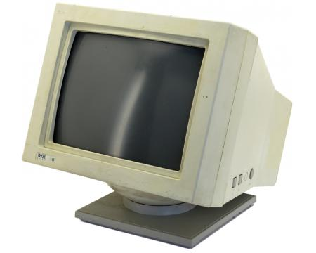

# Using Commands 

In this lesson you'll learn the basics of the shell, how commands are processed and how they interact with you and Linux. Afterward you should be able to: 

  - Describe the difference between the terminal and the shell 
  - Name the steps the shell uses to process commands 
  - List the contents of the current directory 
  - Describe what a file is and how to view its contents
  - Get help using the manual 

Here are the commands you will learn in this lesson.

| Command | Action | 
| --- | --- | 
| `echo`	| Write something to the screen |
| `banner` | Make a big banner (*for fun*) | 
| `ls` | List the contents of the current directory | 
| `tree` | Show the structure of the current directory | 
| `cat` | View the contents of a file |
| `file` | View the type of a file |
| `type` | Show the location of a command | 
| `bc` | A command line calculator. |

## The Terminal and the Shell 

The terminal is the program you use on your computer to view the command line. The terminal is software that takes the place of the old-school terminal hardware like the thing pictured below: 



When the terminal is a program it's called a *terminal emulator* but since it's been so long since anyone has seen a real terminal everyone just says *terminal*. The shell is the program that shows you the prompt and accepts commands. The shell runs on the remote side of a network connection. When you use the `ssh` command to access another computer the terminal runs on your computer and the shell is started by `ssh` after you enter your login credentials. 

## How Commands are Processed 

Commands are executed in stages. Understanding the stages is important to understanding error messages that appear when you make a mistake typing a command. 

| Step | Title | Description | 
| --- | --- | --- | 
| 1 | **Prompt** | Print the prompt and wait for the user to type a command and the `Enter` key | 
| 2 | **Parse** | *Parsing* is the process of turing the command you typed to a plan for action. During the parsing phase the shell breaks the line into a command and arguments. The shell also processes special characters like the wildcard `*` character and shell variables. | 
| 3 | **Search** | Once the command name is determined the shell searches for the command. |
| 4 | **Execute** | When the command is found the shell exectues the command. | 
| 5 | **Nap** | While the command is running the shell goes to sleep and waits for the command to finish. | 
| 6 | **Repeat** | Go back to step 1! | 

The most common mistakes are making a typo in a command or trying to execute a command that doesn't exist. Here's what the shell tells you when the search for a command fails: 

```bash 
simben90@opus3:~$ bogus 
bogus: command not found
```

Remember the words `command not found`. They tell you that there's a problem with the command you entered. The message comes from step 3 when the search fails. 

```bash
simben90@opus3:~$ cat nosuchfile
cat: nosuchfile: No such file or directory
```

In the example above `cat` failed to find the file. Here's another example of an error from `cat`: 

```bash
simben90@opus3:~$ cat -x 
cat: invalid option -- 'x'
Try 'cat --help' for more information.
```

The error messages from the last two examples come from `cat` itself during the step 4, Execution. When an error comes from a command the error message depends on the authors of the command. There are too many errors to list or know. 

## `echo` and `banner`: The shell talks back 

The `echo` and `banner` commands repeat their arguments. The `echo` command is useful when you want a shell program to print something (we'll talk about shell programming near the end of the semester). The `banner` program turns its arguments into a big-size banner. 

Forms of the command: 

| Command Form | Description | 
| --- | --- | 
| `echo [message...]` | Repeat the words on the command line. | 
| `banner [message...]` | Make a banner using the words on the command line. |

Here's a demo: 

<script id="asciicast-jxaIPeUHSTBZRwszrmsKofHd1" src="https://asciinema.org/a/jxaIPeUHSTBZRwszrmsKofHd1.js" async></script>

## Files and Directories 

Files are the way that computers store data permanently. On graphical desktops files are organized into *folders*, on Unix the proper term is *directory*. The `ls` command lists the contents of the *current directory*. I'll explain the current directory later. 

You should know these forms of the command:

| Command Form | Description | 
| --- | --- | 
| `ls -l` | List the contents of the current directory | 
| `ls <file|directory>` | List a single file or directory | 
| `ls -l` | Long listing (one per line) with extra information | 
| `ls -a` | List all files (including hidden files) | 
| `tree` | Show the directory tree | 

Here's a demonstration of `ls`. 

<script id="asciicast-UO9V5SL4aPjRhfLZZjnZiuQnD" src="https://asciinema.org/a/UO9V5SL4aPjRhfLZZjnZiuQnD.js" async></script>

Notice the `ls` command uses a switch. Try running both commands on your own: 

```bash
$ ls 
$ ls -l 
```

The `-l` switch means *long listing*. In long form the `ls` command prints one file per line with a bunch of extra information that we'll talk about in the next lesson. The `ls` command color codes its output. Directories are colored blue in the example above. 

Directories contain both files and other directories. The `tree` commands shows the structure of the current directory. 

<script id="asciicast-LnQpO6A0YfReFQiCrb6vAxtC6" src="https://asciinema.org/a/LnQpO6A0YfReFQiCrb6vAxtC6.js" async></script>

Run the `tree` command and look at the output. You should see output very similar to mine. 

## Examining Files 

The `cat` command prints the contents of a file to the screen. 

| Command Form | Description | 
| --- | --- | 
| `cat` | Repeat what you type until you type `Ctrl-d` | 
| `cat <filename>` | Write the contents of the file to the screen. | 

Here's an example of using `cat`:

<script id="asciicast-cLYAPgoCkF4VnzY6JNK8zeuSr" src="https://asciinema.org/a/cLYAPgoCkF4VnzY6JNK8zeuSr.js" async></script>

The `mission` file in your home directory contains the mission of Cabrillo college. Files can contain different *types* of data. The `file` command examines the file and tells you what type of data it contains. Here's how to use the `file` command: 

<script id="asciicast-g8kNEXS1AgIPp52R1FWmJAePH" src="https://asciinema.org/a/g8kNEXS1AgIPp52R1FWmJAePH.js" async></script>

> Notice that using the `*` as an argument shows the type of all files in the directory. The `*` is known as the wildcard. 

Not all files can be printed with `cat` only *text* files can be. Look at the output above and find the file listed as data. What happens when you use `cat` on that file? 

## Where Do Commands Come From? 

The `type` command gives you information on files. The `type` command takes one argument, the name of a command. 

| Command Form | Description | 
| --- | --- | 
| type <command> | Show information about the command | 

See what happens when you run `type` on ths commands from this lecture:

<script id="asciicast-GmtzbXa1A0B6x2Nat40MC3j9X" src="https://asciinema.org/a/GmtzbXa1A0B6x2Nat40MC3j9X.js" async></script>

Run the `type` command on each of the commands you've learned so far. 

