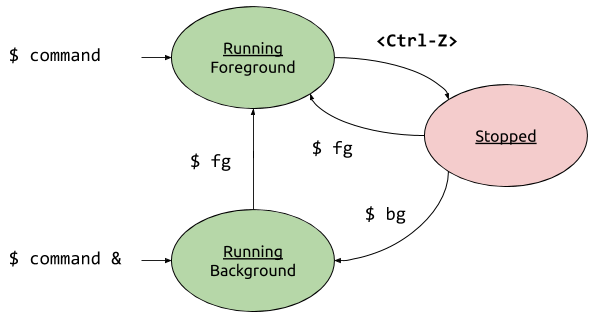

# Processes and Jobs 

In this lesson you will learn how to use the commands: 

| Command | Action | 
| --- | --- | 
| `ps` | Show running processes | 
| `top` | Interactively show processes | 
| `time` | Time a command to see how long it takes | 
| `kill` | Send a signal to a process (often to stop it) | 
| `at` | Schedule a task to be run in the future | 

When a program executes it becomes a process. If a program on disk is a book then reading it is a process. Linux allocates the computer's resources to processes as they need them. There are three categories of resources that a process uses:

  - **CPU time**. A process consumes processor time as it executes. A CPU can only execute one process at a time, so the amount of compute time is limited by the number of CPU cores in the computer.
  - **Memory**. Programs must be loaded into memory before they can execute and usually request additional memory to do their work. Memory is a limited resource, when it gets scarce computers run very slowly.
  - **File Handles**. File handles are for more than just files. All I/O functions on Linux are performed using file handles, including network I/O and communicating with device drivers.

This introduction will show you how to control process execution, examine process resources and understand how Linux manages the resources of the computer.

## Controlling Processes

A process is a running program. Processes use the CPU to execute instructions. The processes we've used so far in the class have usually executed quickly and finished, causing the shell to return to the prompt. What happens when you use the `cat` command with no arguments? 

```
$ cat
```

The `cat` program reads from `stdin` and keeps running until you tell it to stop. So far, you've done this in two ways. 

  - `Ctrl-d` sends the "End of File" character which tells `cat` that there's no more input. 
  - `Ctrl-c` sends the *interrupt signal* (`SIGINT`) causing `cat` to quit.

Now let's use the `ping` command. The `ping` command helps administrators diagnose network problems. It sends a "ping" packet to a remote host and waits to hear a "pong" back. Try using the ping command to send pings to `enterprise.cis.cabrillo.edu`: 

```
$ ping enterprise.cis.cabrillo.edu 
PING enterprise (192.168.100.12) 56(84) bytes of data.
64 bytes from enterprise (192.168.100.12): icmp_seq=1 ttl=63 time=0.857 ms
64 bytes from enterprise (192.168.100.12): icmp_seq=2 ttl=63 time=0.508 ms
64 bytes from enterprise (192.168.100.12): icmp_seq=3 ttl=63 time=0.418 ms
64 bytes from enterprise (192.168.100.12): icmp_seq=4 ttl=63 time=0.440 ms
64 bytes from enterprise (192.168.100.12): icmp_seq=5 ttl=63 time=0.344 ms
64 bytes from enterprise (192.168.100.12): icmp_seq=6 ttl=63 time=0.348 ms
64 bytes from enterprise (192.168.100.12): icmp_seq=7 ttl=63 time=0.453 ms
64 bytes from enterprise (192.168.100.12): icmp_seq=8 ttl=63 time=0.398 ms
^C
--- enterprise ping statistics ---
8 packets transmitted, 8 received, 0% packet loss, time 7149ms
rtt min/avg/max/mdev = 0.344/0.470/0.857/0.156 ms
``` 

The `ping` program will not quit until you tell it to stop with `Ctrl-c`. 

What if you wanted to *pause* the `ping` program and come back to it later? You can put a process into the *background* by typing `Ctrl-z` while it's running. Try this with `ping`: 

```
$ ping enterprise.cis.cabrillo.edu 
PING enterprise (192.168.100.12) 56(84) bytes of data.
64 bytes from enterprise (192.168.100.12): icmp_seq=1 ttl=63 time=0.668 ms
64 bytes from enterprise (192.168.100.12): icmp_seq=2 ttl=63 time=0.372 ms
64 bytes from enterprise (192.168.100.12): icmp_seq=3 ttl=63 time=0.451 ms
64 bytes from enterprise (192.168.100.12): icmp_seq=4 ttl=63 time=0.381 ms
^Z
[2]+  Stopped                 ping enterprise.cis.cabrillo.edu
```

Notice that `ping` didn't show you statistics. Where did it go? The `ps` command shows you running processes. If you followed the last section you should see `ping` in the output of `ps`: 

```
$ ps 
  PID TTY          TIME CMD
 6348 pts/1    00:00:00 bash
 8076 pts/1    00:00:00 ping
 8092 pts/1    00:00:00 ps
```

You can get more information from `ps` with the `-l` option: 

```
$ ps -l 
F S   UID   PID  PPID  C PRI  NI ADDR SZ WCHAN  TTY          TIME CMD
4 S  1001  6348  6347  0  80   0 -  5700 wait   pts/1    00:00:00 bash
4 T  1001  8076  6348  0  80   0 -  4627 -      pts/1    00:00:00 ping
0 R  1001  8120  6348  0  80   0 -  7227 -      pts/1    00:00:00 ps
```

The `ping` command is still running, BASH is keeping it as a *job* for you. You can see all of your jobs using the `jobs` command: 

```
$ jobs
[2]+  Stopped                 ping enterprise.cis.cabrillo.edu
``` 

A job is in one of three states: 

1. In the foreground (running)
1. Stopped in the background 
1. Running in the background 

When a job is stopped the `fg` command puts it into the foreground and runs it. Try that with `ping`. After a few pings press `Ctrl-z` again to stop it. 

```
$ fg
ping enterprise.cis.cabrillo.edu
64 bytes from enterprise (192.168.100.12): icmp_seq=5 ttl=63 time=1.04 ms
64 bytes from enterprise (192.168.100.12): icmp_seq=6 ttl=63 time=0.389 ms
64 bytes from enterprise (192.168.100.12): icmp_seq=7 ttl=63 time=0.383 ms
64 bytes from enterprise (192.168.100.12): icmp_seq=8 ttl=63 time=0.335 ms
^Z
[2]+  Stopped                 ping enterprise.cis.cabrillo.edu
```

Now let's do something more surprising. Use the `bg` command to put `ping` into background:

<script id="asciicast-rnnKCmoSFloNmsbxMpKpt5wZq" src="https://asciinema.org/a/rnnKCmoSFloNmsbxMpKpt5wZq.js" async></script>

When a command is in the background it runs and that can mess up everything! You can start a process in the background by putting an ampersand (`&`) after the command: 

```
$ ping enterprise.cis.cabrillo.edu &
```

The drawing below will help you remember the states a process can be in:



## The Process Tree 

Each process has a *parent process*. The parent process is the process that was responsible for starting the program and receives a signal when the child process exits. The output of the `ps` command shows you the *process ID* (`PID`) of each process and the *parent process ID* (`PPID`).

```
$ ps -l 
F S   UID   PID  PPID  C PRI  NI ADDR SZ WCHAN  TTY          TIME CMD
4 S  1001  6348  6347  0  80   0 -  5700 wait   pts/1    00:00:00 bash
0 R  1001  9532  6348  0  80   0 -  7227 -      pts/1    00:00:00 ps
```

Note that the parent process of `ps` is `bash`. But who's the parent of `bash`? The `-e` option to `ps` shows you all the processes on the system: 

```
$ ps -el 
F S   UID   PID  PPID  C PRI  NI ADDR SZ WCHAN  TTY          TIME CMD
4 S     0     1     0  0  80   0 - 56344 -      ?        00:00:27 systemd
1 S     0     2     0  0  80   0 -     0 -      ?        00:00:00 kthreadd
1 I     0     3     2  0  60 -20 -     0 -      ?        00:00:00 rcu_gp
1 I     0     4     2  0  60 -20 -     0 -      ?        00:00:00 rcu_par_gp
1 I     0     6     2  0  60 -20 -     0 -      ?        00:00:00 kworker/0:0H-kb
1 I     0     9     2  0  60 -20 -     0 -      ?        00:00:00 mm_percpu_wq
1 S     0    10     2  0  80   0 -     0 -      ?        00:00:01 ksoftirqd/0
1 I     0    11     2  0  80   0 -     0 -      ?        00:01:16 rcu_sched
1 S     0    12     2  0 -40   - -     0 -      ?        00:00:02 migration/0
5 S     0    13     2  0   9   - -     0 -      ?        00:00:00 idle_inject/0
1 S     0    14     2  0  80   0 -     0 -      ?        00:00:00 cpuhp/0
1 S     0    15     2  0  80   0 -     0 -      ?        00:00:00 cpuhp/1
5 S     0    16     2  0   9   - -     0 -      ?        00:00:00 idle_inject/1
1 S     0    17     2  0 -40   - -     0 -      ?        00:00:03 migration/1
1 S     0    18     2  0  80   0 -     0 -      ?        00:00:00 ksoftirqd/1
1 I     0    20     2  0  60 -20 -     0 -      ?        00:00:00 kworker/1:0H-kb
5 S     0    21     2  0  80   0 -     0 -      ?        00:00:00 kdevtmpfs
1 I     0    22     2  0  60 -20 -     0 -      ?        00:00:00 netns
1 S     0    23     2  0  80   0 -     0 -      ?        00:00:00 rcu_tasks_kthre
1 S     0    24     2  0  80   0 -     0 -      ?        00:00:00 kauditd
1 S     0    25     2  0  80   0 -     0 -      ?        00:00:00 khungtaskd
1 S     0    26     2  0  80   0 -     0 -      ?        00:00:00 oom_reaper
1 I     0    27     2  0  60 -20 -     0 -      ?        00:00:00 writeback
1 S     0    28     2  0  80   0 -     0 -      ?        00:00:00 kcompactd0
1 S     0    29     2  0  85   5 -     0 -      ?        00:00:00 ksmd
1 S     0    30     2  0  99  19 -     0 -      ?        00:00:00 khugepaged
1 I     0   123     2  0  60 -20 -     0 -      ?        00:00:00 kintegrityd
1 I     0   124     2  0  60 -20 -     0 -      ?        00:00:00 kblockd
1 I     0   125     2  0  60 -20 -     0 -      ?        00:00:00 blkcg_punt_bio
1 I     0   126     2  0  60 -20 -     0 -      ?        00:00:00 tpm_dev_wq
1 I     0   127     2  0  60 -20 -     0 -      ?        00:00:00 ata_sff
1 I     0   128     2  0  60 -20 -     0 -      ?        00:00:00 md
1 I     0   129     2  0  60 -20 -     0 -      ?        00:00:00 edac-poller
1 I     0   130     2  0  60 -20 -     0 -      ?        00:00:00 devfreq_wq
1 S     0   131     2  0 -40   - -     0 -      ?        00:00:00 watchdogd
1 S     0   135     2  0  80   0 -     0 -      ?        00:00:00 kswapd0
1 I     0   136     2  0  60 -20 -     0 -      ?        00:00:00 kworker/u5:0
1 S     0   137     2  0  80   0 -     0 -      ?        00:00:00 ecryptfs-kthrea
1 I     0   140     2  0  60 -20 -     0 -      ?        00:00:00 kthrotld
1 I     0   141     2  0  60 -20 -     0 -      ?        00:00:00 acpi_thermal_pm
1 S     0   142     2  0  80   0 -     0 -      ?        00:00:00 scsi_eh_0
1 I     0   143     2  0  60 -20 -     0 -      ?        00:00:00 scsi_tmf_0
1 S     0   144     2  0  80   0 -     0 -      ?        00:00:00 scsi_eh_1
1 I     0   145     2  0  60 -20 -     0 -      ?        00:00:00 scsi_tmf_1
1 I     0   147     2  0  60 -20 -     0 -      ?        00:00:00 ipv6_addrconf
1 I     0   160     2  0  60 -20 -     0 -      ?        00:00:00 kstrp
1 I     0   179     2  0  60 -20 -     0 -      ?        00:00:00 charger_manager
1 I     0   218     2  0  60 -20 -     0 -      ?        00:00:00 cryptd
1 I     0   237     2  0  60 -20 -     0 -      ?        00:00:04 kworker/0:1H-kb
1 I     0   259     2  0  60 -20 -     0 -      ?        00:00:00 ttm_swap
1 I     0   333     2  0  60 -20 -     0 -      ?        00:00:00 raid5wq
1 I     0   387     2  0  60 -20 -     0 -      ?        00:00:06 kworker/1:1H-kb
1 S     0   389     2  0  80   0 -     0 -      ?        00:00:16 jbd2/vda1-8
1 I     0   390     2  0  60 -20 -     0 -      ?        00:00:00 ext4-rsv-conver
4 S     0   457     1  0  79  -1 - 34741 -      ?        00:02:47 systemd-journal
1 I     0   459     2  0  60 -20 -     0 -      ?        00:00:00 iscsi_eh
4 S     0   465     1  0  80   0 - 26475 -      ?        00:00:00 lvmetad
4 S     0   467     1  0  80   0 - 11350 -      ?        00:00:02 systemd-udevd
1 I     0   468     2  0  60 -20 -     0 -      ?        00:00:00 ib-comp-wq
1 I     0   469     2  0  60 -20 -     0 -      ?        00:00:00 ib-comp-unb-wq
1 I     0   470     2  0  60 -20 -     0 -      ?        00:00:00 ib_mcast
1 I     0   471     2  0  60 -20 -     0 -      ?        00:00:00 ib_nl_sa_wq
1 I     0   483     2  0  60 -20 -     0 -      ?        00:00:00 rdma_cm
4 S   100   539     1  0  80   0 - 17962 -      ?        00:00:03 systemd-network
4 S   101   580     1  0  80   0 - 17691 -      ?        00:00:02 systemd-resolve
4 S 62583   581     1  0  80   0 - 35482 -      ?        00:00:01 systemd-timesyn
4 S     0   586     1  0  80   0 - 132819 -     ?        00:00:11 lxcfs
4 S     1   587     1  0  80   0 -  7082 -      ?        00:00:00 atd
4 S     0   588     1  0  80   0 - 42599 -      ?        00:00:00 networkd-dispat
4 S     0   590     1  0  80   0 - 71962 -      ?        00:00:40 accounts-daemon
4 S   103   591     1  0  80   0 - 12543 -      ?        00:00:32 dbus-daemon
4 S     0   598     1  0  80   0 - 27620 -      ?        00:00:17 irqbalance
4 S     0   599     1  0  80   0 -  7829 -      ?        00:00:01 cron
4 S     0   601     1  0  80   0 - 17664 -      ?        00:00:02 systemd-logind
4 S   102   602     1  0  80   0 - 65758 -      ?        00:00:31 rsyslogd
4 S     0   617     1  0  80   0 - 72220 -      ?        00:00:17 polkitd
4 S     0   622     1  0  80   0 - 46809 -      ?        00:00:00 unattended-upgr
4 S     0   659   778  0  80   0 - 26421 -      ?        00:00:00 sshd
5 S  1035   759   659  0  80   0 - 27262 -      ?        00:00:04 sshd
0 S  1035   760   759  0  80   0 -  3253 -      ?        00:00:00 bash
4 S     0   778     1  0  80   0 - 18074 -      ?        00:00:45 sshd
4 S     0   779     1  0  80   0 - 19717 -      tty1     00:00:00 login
0 S  1035   801   760  0  80   0 -  1156 -      ?        00:00:00 sh
0 S  1035   808   801  0  80   0 - 242440 -     ?        00:00:06 node
0 S  1035   859   808  0  80   0 - 225380 -     ?        00:00:03 node
0 S  1035   872   808  0  80   0 - 255696 -     ?        00:00:35 node
0 S  1035   937   872  0  80   0 - 141911 -     ?        00:00:01 node
0 S  1035   948   872  0  80   0 -  5673 -      pts/3    00:00:00 bash
5 S     0   952     1  0  80   0 - 16844 -      ?        00:00:03 master
4 S   111   956   952  0  80   0 - 18465 -      ?        00:00:00 qmgr
4 S  1000  1326     1  0  80   0 - 19161 -      ?        00:00:00 systemd
5 S  1000  1332  1326  0  80   0 - 27911 -      ?        00:00:00 (sd-pam)
5 I     0  3279     2  0  80   0 -     0 -      ?        00:00:00 kworker/0:0-eve
5 I     0  3633     2  0  80   0 -     0 -      ?        00:00:05 kworker/0:1-eve
4 S  1000  3735   779  0  80   0 -  5701 -      tty1     00:00:00 bash
4 S     0  6132   778  0  80   0 - 26996 -      ?        00:00:00 sshd
5 S  1000  6232  6132  0  80   0 - 26996 -      ?        00:00:00 sshd
0 S  1000  6233  6232  0  80   0 -  5668 -      pts/1    00:00:00 bash
4 S     0  6346  6233  0  80   0 - 15938 -      pts/1    00:00:00 sudo
4 S     0  6347  6346  0  80   0 - 15761 -      pts/1    00:00:00 su
4 S  1001  6348  6347  0  80   0 -  5700 wait   pts/1    00:00:00 bash
4 S     0  6386   778  0  80   0 - 26996 -      ?        00:00:00 sshd
5 S  1000  6465  6386  0  80   0 - 27024 -      ?        00:00:00 sshd
0 S  1000  6466  6465  0  80   0 -  5668 -      pts/4    00:00:00 bash
4 S     0  6559  6466  0  80   0 - 15878 -      pts/4    00:00:00 sudo
4 S     0  6560  6559  0  80   0 - 15761 -      pts/4    00:00:00 su
4 S  1001  6561  6560  0  80   0 -  5667 poll_s pts/4    00:00:00 bash
4 S   111  7565   952  0  80   0 - 18453 -      ?        00:00:00 pickup
4 S     0  7904   778  0  80   0 - 26421 -      ?        00:00:00 sshd
4 S  1022  7906     1  0  80   0 - 19164 -      ?        00:00:00 systemd
5 S  1022  7907  7906  0  80   0 - 64840 -      ?        00:00:00 (sd-pam)
5 S  1022  8015  7904  0  80   0 - 26996 -      ?        00:00:00 sshd
0 S  1022  8016  8015  0  80   0 -  5701 -      pts/5    00:00:00 bash
5 I     0  8364     2  0  80   0 -     0 -      ?        00:00:00 kworker/1:0-eve
0 T  1022  8547  8016  0  80   0 -  2461 -      pts/5    00:00:00 less
0 T  1022  8613  8016  0  80   0 -  2461 -      pts/5    00:00:00 less
1 I     0  8868     2  0  80   0 -     0 -      ?        00:00:00 kworker/u4:0-ev
1 I     0  9146     2  0  80   0 -     0 -      ?        00:00:00 kworker/u4:2-ev
0 T  1022  9394  8016  0  80   0 -  3055 -      pts/5    00:00:00 bc
4 S     0  9531   778  0  80   0 - 18074 -      ?        00:00:00 sshd
0 S  1035  9551   760  0  80   0 -  1866 -      ?        00:00:00 sleep
4 S     0  9572   778  1  80   0 - 18074 -      ?        00:00:00 sshd
0 R  1001  9573  6348  0  80   0 -  7227 -      pts/1    00:00:00 ps
4 S     0 27661   778  0  80   0 - 26421 -      ?        00:00:00 sshd
4 S  1035 27663     1  0  80   0 - 19163 -      ?        00:00:00 systemd
5 S  1035 27664 27663  0  80   0 - 27974 -      ?        00:00:00 (sd-pam)
5 S  1035 27779 27661  0  80   0 - 27106 -      ?        00:00:01 sshd
0 S  1035 27780 27779  0  80   0 -  5751 -      pts/0    00:00:02 bash
5 I     0 29250     2  0  80   0 -     0 -      ?        00:00:28 kworker/1:1-eve
```

Can you trace the parents of the `ps` command all the way to the parent of all processes? What is it? 

The `pstree` command makes a nice view of processes: 

```
$ pstree 
systemd─┬─accounts-daemon───2*[{accounts-daemon}]
        ├─atd
        ├─cron
        ├─dbus-daemon
        ├─irqbalance───{irqbalance}
        ├─login───bash
        ├─lvmetad
        ├─lxcfs───7*[{lxcfs}]
        ├─master─┬─pickup
        │        └─qmgr
        ├─networkd-dispat───{networkd-dispat}
        ├─polkitd───2*[{polkitd}]
        ├─rsyslogd───3*[{rsyslogd}]
        ├─sh───node─┬─node───10*[{node}]
        │           ├─node─┬─bash
        │           │      ├─node───6*[{node}]
        │           │      └─16*[{node}]
        │           └─11*[{node}]
        ├─sshd─┬─sshd───sshd───bash───sudo───su───bash───pstree
        │      ├─sshd───sshd───bash───sudo───su───bash
        │      ├─sshd───sshd───bash─┬─bc
        │      │                    └─2*[less]
        │      └─2*[sshd───sshd]
        ├─3*[systemd───(sd-pam)]
        ├─systemd-journal
        ├─systemd-logind
        ├─systemd-network
        ├─systemd-resolve
        ├─systemd-timesyn───{systemd-timesyn}
        ├─systemd-udevd
        └─unattended-upgr───{unattended-upgr}
```

If you run `pstree` with the `-u` option it shows you who owns each of the processes. You can see processes running in real time using the `top` command. 

<script id="asciicast-4KkbSDcDCjx65Yw22zgYr4M3M" src="https://asciinema.org/a/4KkbSDcDCjx65Yw22zgYr4M3M.js" async></script>

The `top` command gives you lots of useful information about the system. 


### CPU Time 

Linux keeps track of the time a process spends executing. Execution time is collected as user time, the time a process spends running it's own instructions, and as system time, the time that the Linux kernel spends executing on behalf of the process. Linux executes on behalf of a process when the process requests something from the kernel like reading a file or printing output to the screen. Time spent waiting for the disk doesn't count as system time only the time it took the kernel to initiate the disk operation.

You can ask `ps` to sort it's output by a column of your choosing. The following command prints processes sorted by time, from the least to the most.

```
$ ps -ely --sort time
S   UID   PID  PPID  C PRI  NI   RSS    SZ WCHAN  TTY          TIME CMD
 [output snipped]
S  1000  3542  2756  0  80   0 10300 129456 poll_s ?       00:00:59 zeitgeist-datah
S     0    80     2  0  99  19     0     0 -      ?        00:01:03 khugepaged
S     0  1828     1  0  80   0  3748 71867 -      ?        00:01:04 accounts-daemon
S  1000 16497 24437 13  80   0 92512 230114 futex_ ?       00:01:21 chrome
S   106  1755     1  0  80   0  4812 109284 -     ?        00:01:26 whoopsie
S     0    11     2  0  80   0     0     0 -      ?        00:01:29 rcuos/3
S     0  2167     1  0  76  -4   764 23496 -      ?        00:01:34 auditd
S  1000  2920  2887  0  80   0 39720 126389 poll_s ?       00:01:37 ibus-ui-gtk3
S     0    10     2  0  80   0     0     0 -      ?        00:01:42 rcuos/2
S  1000  3005  2887  0  80   0  3164 50241 poll_s ?        00:01:48 ibus-engine-sim
S   101   898     1  0  80   0  3192 63970 -      ?        00:01:50 rsyslogd
S     0     8     2  0  80   0     0     0 -      ?        00:01:53 rcuos/0
S     0     9     2  0  80   0     0     0 -      ?        00:02:06 rcuos/1
S  1000  2942  2756  0  80   0 38480 144577 poll_s ?       00:02:09 unity-panel-ser
S     0  1698     1  0  80   0   740  4800 -      ?        00:02:10 irqbalance
S     0   286     2  0  80   0     0     0 -      ?        00:02:27 jbd2/dm-0-8
S     0  3137     1  0  80   0  5172 92863 -      ?        00:02:43 udisksd
S     0    12     2  0  80   0     0     0 -      ?        00:03:46 rcuos/4
S  1000  2887  2756  0  80   0 37444 96472 poll_s ?        00:06:26 ibus-daemon
S     0     7     2  0  80   0     0     0 -      ?        00:06:28 rcu_sched
S  1000 25140 24437  0  80   0 368904 443467 futex_ ?      00:08:04 chrome
S  1000 24735 24437  0  80   0 345592 413394 futex_ ?      00:09:06 chrome
S  1000 25249 24437  0  80   0 374928 336699 futex_ ?      00:09:42 chrome
S  1000  2984  2756  0  69 -11  5120 92434 poll_s ?        00:10:25 pulseaudio
S  1000  3027  2939  0  80   0 69412 388220 poll_s ?       00:10:33 nautilus
S  1000 24514 24421  0  80   0 374168 228887 poll_s ?      00:11:18 chrome
S  1000 24421  2756  1  80   0 362400 328360 poll_s ?      00:21:48 chrome
S     0  1796  1777  0  80   0 85000 127012 -     tty7     01:11:01 Xorg
S  1000  3008  2939  0  80   0 184388 420605 poll_s ?      03:12:40 compiz
```

```
TIME = user time + system time
```

Notice how much more time Google Chrome (chrome) and compiz have spent using the processor than the other processes. Most programs spend almost all of their time waiting. The program with the largest times are the programs that have been historically most active. This was taken on a system that has been up for about 22 days. During that time (528 hours) Xwindows (PID 1796) has only used the CPU for 1 hour 11 minutes and 1 second. 

### Keeping Track of Runtime 

The time command is a useful tool. It acts like a stopwatch but it precisely times the execution of another command or commands:

```
time <command>
```

When the command exits time prints how much time the command spent executing:

```
$ time find / > /dev/null
real   0m27.038s
user   0m2.610s
sys    0m7.824s
```

The output indicates that the command took 27 seconds to finish and that during that time it used 2.6 seconds running user time and 7.8 seconds of system time. We know that find simply listed all the files on my computer and doing so caused a lot of access to the disk. That explains the high system time and waiting for the disk explains why the process spent so much time waiting.

## Memory Use  

Programs run from memory. Executing a program copies it from the disk into memory. Running programs request memory from the system as they operate, ideally they return memory to the system when they don't need it anymore. When a program exits all memory it used is reclaimed and made available for other programs. Linux tracks how much memory each process uses in different ways. Unfortunately, there is no simple answer to the question "how much memory is a process using?" The `ps` command can show you what the kernel knows about a process' memory:

```
$ ps -ly
S  UID  PID PPID C PRI NI  RSS  SZ WCHAN TTY     TIME CMD
R 1000 6105 15856 0 80  0  888 3544 -   pts/0  00:00:00 ps
S 1000 15856 15846 0 80  0 5208 7021 wait  pts/0  00:00:00 bash
```

The two memory columns are:

  - **Resident Set Size (RSS) KiB**. The resident set is the amount of physical memory that the program is using. Memory that's swapped to disk doesn't count.
  - **Virtual Memory Size (SZ) KiB**. This is all the memory that's in use by the process, including memory that's paged out and shared with other programs. SZ is always greater than RSS.

It's often useful to know what programs are using the most memory on a system. To do that you can set the sort order to RSS. The following command shows the 10 programs using the most memory:

```
$ ps -ely --sort rss | tail -n 10
S 1000 5938 4210 0 80  0 100776 224853 futex_ ?   00:00:07 chrome
S 1000 5753 3701 0 90 10 115456 183024 poll_s ?   00:00:02 update-manager
S 1000 4332 3701 0 80  0 122836 985611 poll_s ?   00:03:13 dropbox
S 1000 15192 4210 0 80  0 155480 250722 futex_ ?   00:02:31 chrome
S 1000 4343 4210 0 80  0 159028 314072 futex_ ?   00:01:33 chrome
S 1000 4283 4077 0 80  0 213148 159661 poll_s ?   00:06:39 chrome
S 1000 4047 3881 0 80  0 231856 474842 poll_s ?   00:20:35 compiz
S 1000 4077 3881 0 80  0 276812 340444 poll_s ?   00:22:00 chrome
S 1000 8608 4210 0 80  0 351624 463671 futex_ ?   00:17:08 chrome
S 1000 8888 4210 0 80  0 389140 398256 futex_ ?   00:19:31 chrome
```

## Signals 

When the kernel needs to get a process' attention it sends the process a signal. When a process receives a signal it momentarily stops what it was doing to acknowledge that it's received the signal. Depending on what signal was received the process may continue or it may exit. Signals can come from two sources, they can be sent directly by the kernel or they can come from other programs. The kill command sends signals to processes from the command line. Despite it's name kill does not necessarily kill a process. Signals are numbered, and the signals meaning is based on it's number. To see a list of all signals available run the kill command:

```
$ kill -l 
 1) SIGHUP	 2) SIGINT	 3) SIGQUIT	 4) SIGILL	 5) SIGTRAP
 6) SIGABRT	 7) SIGBUS	 8) SIGFPE	 9) SIGKILL	10) SIGUSR1
11) SIGSEGV	12) SIGUSR2	13) SIGPIPE	14) SIGALRM	15) SIGTERM
16) SIGSTKFLT	17) SIGCHLD	18) SIGCONT	19) SIGSTOP	20) SIGTSTP
21) SIGTTIN	22) SIGTTOU	23) SIGURG	24) SIGXCPU	25) SIGXFSZ
26) SIGVTALRM	27) SIGPROF	28) SIGWINCH	29) SIGIO	30) SIGPWR
31) SIGSYS	34) SIGRTMIN	35) SIGRTMIN+1	36) SIGRTMIN+2	37) SIGRTMIN+3
38) SIGRTMIN+4	39) SIGRTMIN+5	40) SIGRTMIN+6	41) SIGRTMIN+7	42) SIGRTMIN+8
43) SIGRTMIN+9	44) SIGRTMIN+10	45) SIGRTMIN+11	46) SIGRTMIN+12	47) SIGRTMIN+13
48) SIGRTMIN+14	49) SIGRTMIN+15	50) SIGRTMAX-14	51) SIGRTMAX-13	52) SIGRTMAX-12
53) SIGRTMAX-11	54) SIGRTMAX-10	55) SIGRTMAX-9	56) SIGRTMAX-8	57) SIGRTMAX-7
58) SIGRTMAX-6	59) SIGRTMAX-5	60) SIGRTMAX-4	61) SIGRTMAX-3	62) SIGRTMAX-2
63) SIGRTMAX-1	64) SIGRTMAX	
```

There may be different signals on different UNIX systems, but most are common. The manual for signal(7) describes each of the signals fully. There are a few signals that every admin should know.

  * `SIGHUP` (1). Hangup. This signal causes some programs to reload their configuration files or display some information.
  * `SIGINT` (2). Interrupt. This is the signal that BASH sends to a program when you type `CTRL-C` on the keyboard.
  * `SIGQUIT` (2). Quit. This is the signal that BASH sends to a program when you type `CTRL-\` on the keyboard, it's like `SIGINT` but the program should do a core dump as it quits.
  * `SIGKILL` (9). Kill. With extreme prejudice. Programs cannot recover from a `SIGKILL`. They will die immediately.
  * `SIGUSR1` (10). User defined. Programs respond differently. The dd program prints a status update when it receives a `SIGUSR1`.
  * `SIGSTOP` (19). The program is frozen. This is the signal that BASH sends to a program when you type `CTRL-Z`
  * `SIGCONT` (18). Unfreeze the program. This signal is sent when your run the fg or bg command in BASH.
  * `SIGPIPE` (13). Broken pipe. This happens when the program on the right side of a pipe (|) exits before the program on the left is done writing output or when a network connection is closed on the remote end.
  * `SIGBUS` (7), `SIGSEGV` (11). Bus error and segmentation fault, respectively. Programmers will recognize these as the dreaded messages that happen when there's a bug in your program.

You send a signal to a process using the kill command:

```
kill [-<number>] <pid> ...
```

For example, to kill the process with PID 12345 you would run this command:

```
$ kill 12345
```

Kill will send a `SIGTERM` if you don't specify a signal. If that doesn't work run this command:

```
$ kill -9 12345
```

Nothing can survive a `kill -9`. Normal users can only send signals to processes that belong to them. Root can send a signal to any process. The `kill` command can also work on a background job without having to know the PID fo the job. 

```
$ jobs
[1]+  Stopped                 ping enterprise
```

The `ping` program has job numbrer one. You can kill it like so: 

```
$ kill %1 
[1]+  Stopped                 ping enterprise
```
