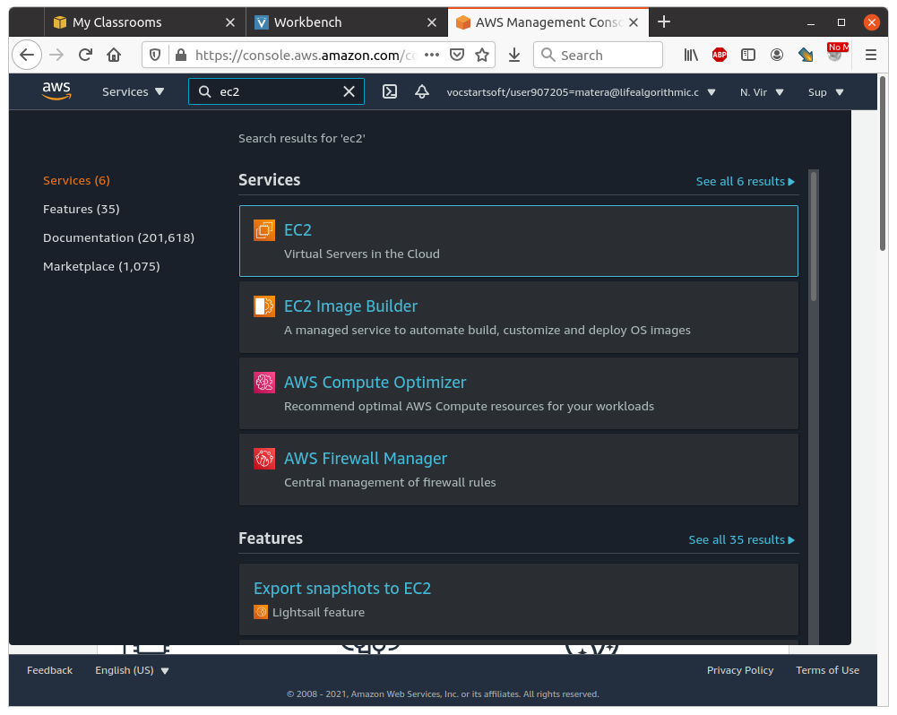
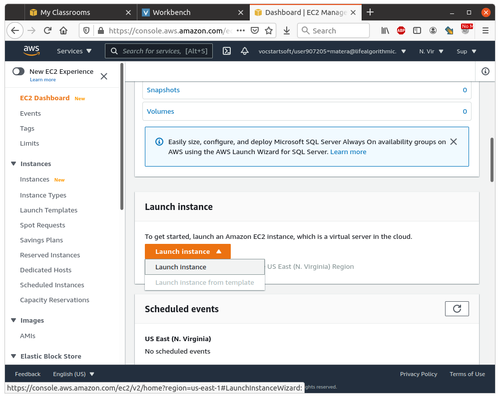
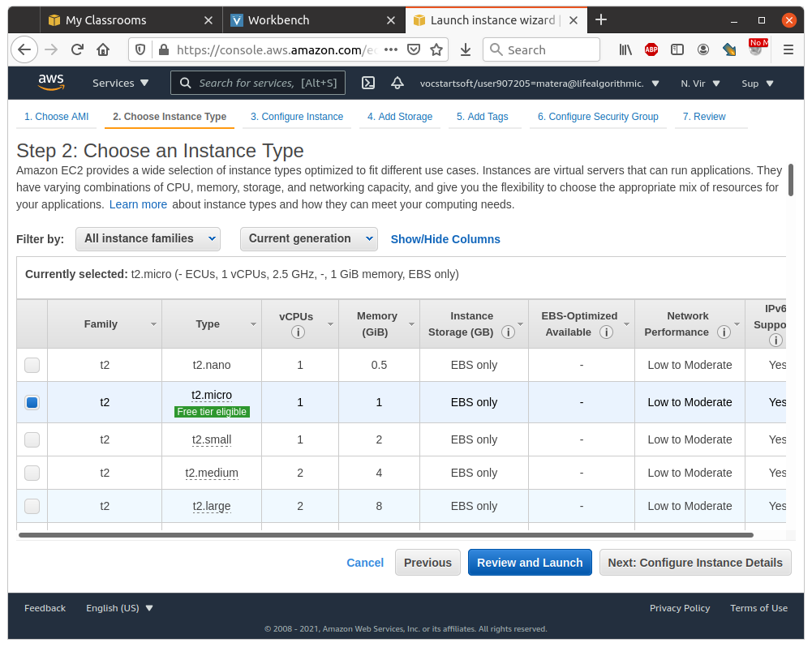
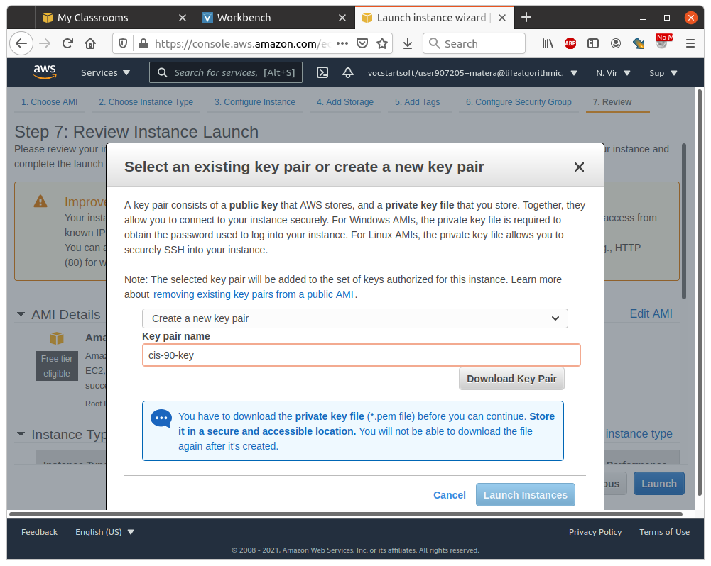
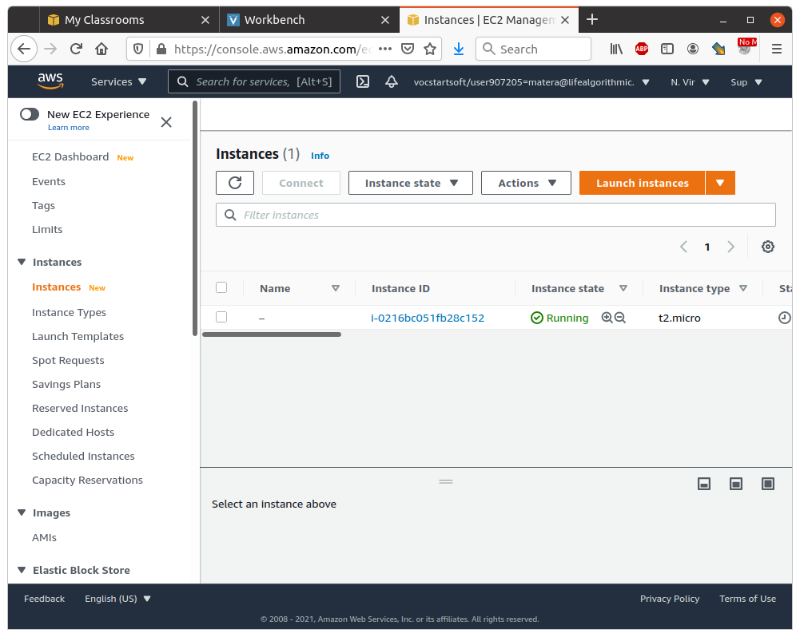
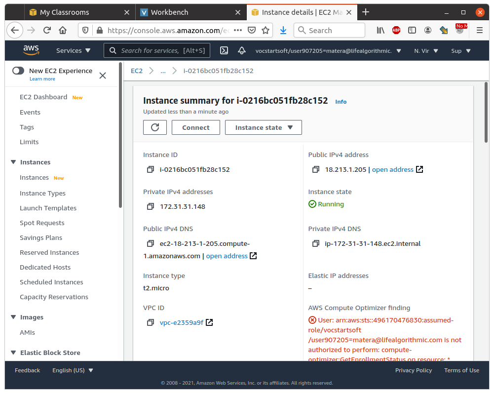

# Create a VM in AWS Educate 

This lab will guide you through the process of creating a VM in the default VPC in your AWS Educate account. Begin by logging in to AWS Educate and navigating to the AWS management console. 

## Step 1: Go to the EC2 Dashboard 

In the service search bar type EC2 and select the service from the results as shown. 



## Step 2.1: Launch an Instance 

Scroll down in the center panel to find the "Launch Instance" button as shown. Click it to enter the lauch intance wizard. 



### Step 2.2: Select an Image Type 

You can choose any Free Tier Eligible Linux. I will use the "Amazon Linux 2 AMI (HVM), SSD Volume Type" image. Click the "Select" button to the right of the image name. 

### Step 2.3: Choose an Instance Type 

Your AWS Educate subscription limits what instance types you can use. The default should be "t2.micro" and will already be selected. Select "Review and Launch"



### Step 2.4: Review and Launch

Press the "Launch" button at the bottom right. This brings up a dialog asking to select an SSH key pair. 

### Step 2.5: SSH Key Pair 

> **IMPORTANT:** AWS machines do not have passwords and can only be accessed via SSH. Failure to save your SSH key will make your AWS machine unusable. 

In the top pulldown select, "Create a new key pair" and name it "cis-90-key" as shown. Click "Download Key Pair" 



The key pair should be in your downloads folder. 

### Step 2.6: Launch Instance 

After downloading your key pair click "Launch Instance". Your AWS VM will take a minute or two to start. 

## Step 3: Install Your Key Pair

Locate the key you downloaded from Amazon. Unlike the keys you generated with `ssh-keygen` both keys are in the same `cis-90-key.pem` file. You must be sure to never leave this file unprotected. Copy the file to your `.ssh` directory. 

## Step 4: Get Your Instance Information 

At the EC2 dashboard find your newly created instance as shown. 



Click the new instance to find it's IP address as shown in this screen: 



## Step 5: Edit Your SSH Configuration 

Edit the `config` file in your SSH configuration directory. I show you how to do this using vscode, but any text editor will work. Add the following information: 

```
Host aws 
        HostName >>aws-ip-address-here<<
        User ec2-user
        IdentityFile ~/.ssh/cis-90-key.pem
```

> Place your VM's IP address after `HostName`. 

> The `ec2-user` is the default for Amazon Linux. If you picked another Linux the username will be different.

## Step 6: Login to Your VM 

Use the SSH command to login to your new VM: 

```
$ ssh aws 
```

## Turn In 

A screenshot of you SSHd into your VM. 

